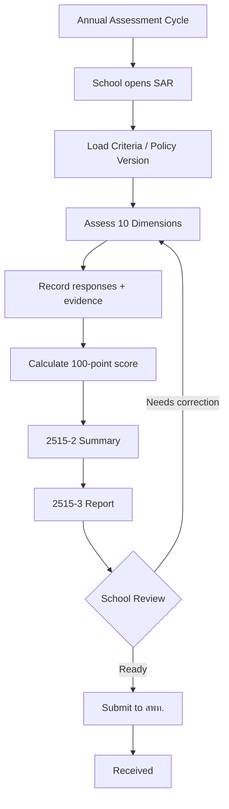
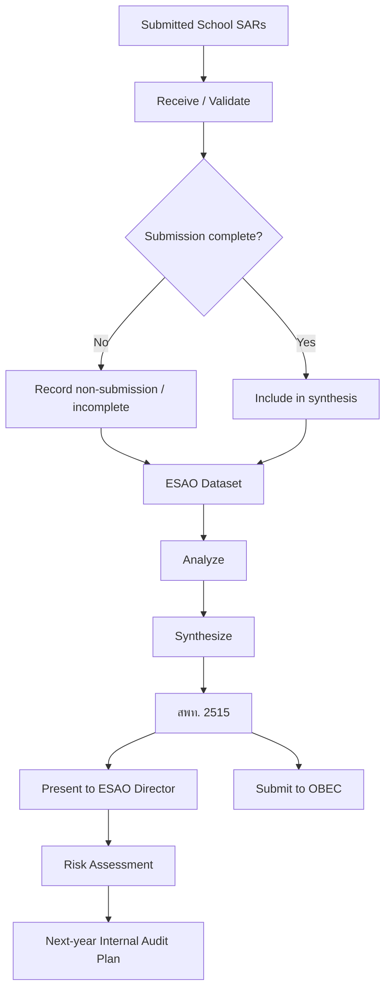

# SchoolBanchee — SAR และ สพท. Assessment Reference

**Document type:** Domain / workflow reference  
**Purpose:** ใช้เป็นข้อมูลอ้างอิงสำหรับการออกแบบระบบ SchoolBanchee  
**Basis:** `SAR_manual_2515.pdf`, `SESAO_Audit_manual_2515.pdf`, และข้อกำหนด/ขอบเขตใน `BLUEPRINT(5).md` และ `p0-05-form-report-sample-register(2).md`  
**Status:** Reference — ไม่ใช่การอนุมัติ policy version ใหม่  
**Prepared:** 13 August 2026

---

## 1. วัตถุประสงค์

เอกสารนี้เรียบเรียงกระบวนการประเมินผลการปฏิบัติงานด้านการเงินและการบัญชีของสถานศึกษาออกเป็น 2 ชั้นที่เกี่ยวข้องกัน:

1. **Annual Self-Assessment (SAR)** — โรงเรียนประเมินตนเองตามเกณฑ์ 10 ประเด็น
2. **สพท. Synthesis / Assessment** — สำนักงานเขตพื้นที่การศึกษารับผลจากโรงเรียน วิเคราะห์ สังเคราะห์ และประมวลผลภาพรวมของโรงเรียนในสังกัด

เอกสารนี้มีไว้เพื่อเป็น reference สำหรับ domain model, workflow, state transition, report และ evidence design ของ SchoolBanchee โดยไม่ถือว่าเป็นการสร้างหรือรับรองเกณฑ์ policy ใหม่

---

## 2. แหล่งข้อมูลและสถานะของหลักฐาน

### 2.1 แหล่งข้อมูลหลัก

| Source | สิ่งที่สนับสนุน |
|---|---|
| `SAR_manual_2515.pdf` | แนวคิด Self Assessment, 10 ประเด็น, เกณฑ์รายข้อ, เอกสาร/หลักฐานประกอบ |
| `SESAO_Audit_manual_2515.pdf` | ขั้นตอน SAR → แบบ 2515-1 → 2515-2 → 2515-3 → ส่ง สพท.; การสังเคราะห์ของ สพท.; ระดับผล; แบบ สพท. 2515 |
| `BLUEPRINT(5).md` | การแยก Annual Self-Assessment ออกจาก School Financial Accounting Audit และการกำหนด Audit Assessment Cycle |
| `p0-05-form-report-sample-register(2).md` | การยืนยันว่า SAR และ School Financial Accounting Audit เป็นคนละ workflow และ GAP-08/GAP-09 ยังมีข้อจำกัดด้าน provenance/current instrument |

### 2.2 ข้อควรระวัง

เอกสารอ้างอิง B.E. 2515 ให้รายละเอียด workflow และ scoring ที่เป็นประโยชน์ต่อการออกแบบ แต่ไม่ได้หมายความว่าเกณฑ์ดังกล่าวเป็น current production policy ของ pilot โดยอัตโนมัติ การนำไปใช้จริงควรผูกกับ **Policy Version / source revision / applicability / effective date** ที่ได้รับอนุมัติ

โดยเฉพาะ School Financial Accounting Audit ของ SESAO ต้องไม่ใช้ scoring/workpaper จากเอกสาร historical audit โดยอัตโนมัติ เพราะ Blueprint ระบุว่า audit instrument ต้องมี checklist version, criteria, workpapers, findings, scoring และ result rules ที่ได้รับการกำหนดอย่างชัดเจน

---

# 3. Conceptual Separation

## 3.1 SAR

**Annual Self-Assessment** คือการที่โรงเรียนประเมินการปฏิบัติงานด้านการเงินและการบัญชีของตนเอง เพื่อทราบว่าการปฏิบัติงานมีความครบถ้วน ถูกต้องตามกฎหมาย ระเบียบ หลักเกณฑ์ และแนวปฏิบัติหรือไม่ และนำผลไปใช้ปรับปรุงการปฏิบัติงาน

ผล SAR จึงเป็น **School-originated assessment result** ไม่ใช่ independent external audit result

## 3.2 สพท. Synthesis

สพท. ทำหน้าที่รับผลจากโรงเรียนในสังกัด แล้ว:

- ตรวจรับ/รวบรวมผล
- วิเคราะห์
- สังเคราะห์
- ประมวลผลภาพรวม
- จำแนกจำนวนโรงเรียนตามระดับผล
- ระบุโรงเรียนที่ไม่ส่งผล
- เสนอผู้บริหาร สพท.
- ใช้เป็นข้อมูลสำหรับ risk assessment และการกำหนดแผนตรวจสอบภายในปีถัดไป
- จัดส่งผลสังเคราะห์ต่อ OBEC ตามขั้นตอนที่เอกสารกำหนด

สพท. ไม่ได้กลายเป็นเจ้าของ canonical financial records ของโรงเรียนจาก workflow นี้

## 3.3 SESAO School Financial Accounting Audit

Audit Assessment เป็น workflow แยกจาก SAR:

`Auditor → Audit Assessment Cycle → Workpapers → Findings → Score/Result → Final Report`

Blueprint กำหนดให้ audit เป็น substantive examination ที่ดำเนินการโดย Auditor และมี audit period, assigned scope, checklist/policy revisions, workpapers, findings, score/result และ report history

**ห้าม merge SAR และ Audit Assessment เป็น entity/workflow เดียวกัน**

---

# 4. SAR — Annual Self-Assessment Flow

```text
เริ่มรอบประเมินประจำปี
        │
        ▼
เปิด SAR ของปีงบประมาณ
        │
        ▼
โหลด Assessment Criteria / Policy Version
        │
        ▼
ประเมิน 10 ประเด็น
        │
        ├── บันทึกผลรายข้อ
        ├── อ้างอิง/แนบหลักฐานที่เกี่ยวข้อง
        └── บันทึกข้อสังเกต/ประเด็นที่ต้องปรับปรุง
        │
        ▼
คำนวณคะแนนแต่ละประเด็น
        │
        ▼
รวมคะแนน 100
        │
        ▼
สร้างแบบ 2515-2
(สรุปผลการประเมิน)
        │
        ▼
สร้างแบบ 2515-3
(รายงานผลการประเมิน)
        │
        ▼
School Review
        │
        ├── ไม่ครบ → แก้ไขข้อมูล
        │
        └── ครบ → Submit
                    │
                    ▼
             ส่ง สพท.
             ภายในเดือนกรกฎาคม
```

เอกสารระบุว่าโรงเรียนประเมินตนเองตาม 10 ประเด็นและบันทึกในแบบ 2515-1 จากนั้นพิจารณาคะแนนในแบบ 2515-2 และข้อมูลแสดงในแบบ 2515-3 ก่อนส่งให้ สพท. ภายในเดือนกรกฎาคม

---

# 5. SAR — 10 Assessment Dimensions

| # | ประเด็น | คะแนนเต็ม |
|---:|---|---:|
| 1 | การบริหารเงินของสถานศึกษา | 10 |
| 2 | การควบคุมเงินคงเหลือ | 20 |
| 3 | การเก็บรักษาเงิน | 5 |
| 4 | การควบคุมการรับเงิน | 10 |
| 5 | การควบคุมการจ่ายเงิน | 20 |
| 6 | การจัดทำบัญชี | 17 |
| 7 | การจัดทำรายงานการเงิน | 5 |
| 8 | การตรวจสอบรับจ่ายประจำวัน | 3 |
| 9 | การควบคุมเงินยืม | 5 |
| 10 | การควบคุมใบเสร็จรับเงิน | 5 |
| | **รวม** | **100** |

คะแนนย่อยของแต่ละข้อควรเก็บเป็นข้อมูลของ assessment criteria version ไม่ควรกระจายเป็น magic numbers ใน application code

---

# 6. SAR Result Levels

จากเอกสาร B.E. 2515:

| ระดับ | คะแนน |
|---|---:|
| ดีมาก | 85–100 |
| ดี | 70–84.50 |
| พอใช้ | 60–69.50 |
| ปรับปรุง | ต่ำกว่า 60 |

ผลระดับควรเก็บเป็น **policy-defined result band** เพื่อให้เปลี่ยนตาม policy version ได้โดยไม่แก้ historical assessment

---

# 7. SAR Submission Package

Logical package:

```text
SAR Assessment
├── Assessment Year
├── School
├── Assessment Criteria / Policy Version
├── 10 Dimensions
│   ├── Criteria Items
│   ├── Response / Result
│   ├── Evidence References
│   └── Score
├── Total Score
├── Result Level
├── 2515-1 Assessment Data
├── 2515-2 Summary
└── 2515-3 Report
```

ระบบควรเก็บทั้ง **result snapshot** และ provenance ของ criteria/policy ที่ใช้ประเมิน เพื่อให้สามารถ reproduce ผลย้อนหลังได้

---

# 8. สพท. Assessment / Synthesis Flow

```text
SAR จากโรงเรียน
      │
      ▼
สพท. รับ Submission
      │
      ▼
ตรวจความครบถ้วน
      │
      ├── ไม่ส่ง/ไม่ครบ
      │       │
      │       ▼
      │   บันทึกเป็น Non-submission / Incomplete
      │
      └── ส่งครบ
              │
              ▼
      รวมข้อมูลทุกโรงเรียน
              │
              ▼
      วิเคราะห์
              │
              ▼
      สังเคราะห์
              │
              ▼
      ประมวลผล
              │
              ▼
       แบบ สพท. 2515
              │
       ┌──────┴────────┐
       ▼               ▼
  เสนอ ผอ. สพท.      ส่ง OBEC
       │
       ▼
Risk Assessment
       │
       ▼
กำหนดแผนตรวจสอบภายใน
ปีงบประมาณถัดไป
```

เอกสารระบุว่าสพท. ต้องวิเคราะห์ สังเคราะห์ และประมวลผลผลการประเมินของสถานศึกษาทุกแห่ง แล้วบันทึกลงในแบบสังเคราะห์ผลการประเมินของ สพท. 2515

---

# 9. สพท. Summary Dataset

แบบ สพท. 2515 มีแนวคิดข้อมูลอย่างน้อยดังนี้:

| Data | ความหมาย |
|---|---|
| Total Schools | จำนวนโรงเรียนทั้งหมดในสังกัด |
| Submitted Schools | จำนวนโรงเรียนที่ส่ง Self Assessment |
| Very Good | จำนวนโรงเรียนระดับดีมาก |
| Good | จำนวนโรงเรียนระดับดี |
| Fair | จำนวนโรงเรียนระดับพอใช้ |
| Improve | จำนวนโรงเรียนระดับปรับปรุง |
| Non-submitted | จำนวนโรงเรียนที่ไม่ส่ง |
| School-level scores | คะแนนรายประเด็นของแต่ละโรงเรียน |

ดังนั้น สพท. Summary ไม่ควรเป็นการ overwrite SAR ของโรงเรียน แต่ควรเป็น **derived/aggregate reporting view** จาก finalized/submitted school assessment records

---

# 10. Recommended State Model

## 10.1 SAR

```text
DRAFT
  │
  ▼
IN_PROGRESS
  │
  ▼
READY_FOR_SUBMISSION
  │
  ▼
SUBMITTED
  │
  ▼
RECEIVED_BY_ESAO
  │
  ▼
FINALIZED
```

กรณีระบบต้องรองรับการตีกลับ:

```text
SUBMITTED
    │
    ▼
RETURNED
    │
    ▼
IN_PROGRESS
```

ควรเก็บ revision/history ไม่ลบ submission เดิมแบบ silent overwrite

## 10.2 สพท. Synthesis

```text
OPEN
  │
  ▼
COLLECTING
  │
  ▼
COLLECTION_CLOSED
  │
  ▼
ANALYZING
  │
  ▼
SYNTHESIZING
  │
  ▼
FINALIZED
  │
  ├──► PRESENTED_TO_ESAO_DIRECTOR
  │
  └──► SUBMITTED_TO_OBEC
```

ชื่อ state เป็นข้อเสนอเชิง domain model ไม่ใช่ชื่อที่ปรากฏในเอกสารราชการโดยตรง

---

# 11. Recommended Relationship Model

```text
AssessmentCriteriaVersion
        │
        ├── AssessmentDimension × 10
        │       │
        │       └── AssessmentCriterionItem
        │
        ▼
SchoolSAR
        │
        ├── School
        ├── FiscalYear
        ├── PolicyVersion
        ├── Criterion Responses
        ├── Evidence References
        ├── Score Snapshot
        ├── Result Level
        └── Submission History
                 │
                 ▼
        ESAO / สพท. Synthesis Cycle
                 │
                 ├── School SAR results
                 ├── Submission status
                 ├── Distribution
                 ├── Dimension aggregates
                 ├── Non-submission list
                 └── Risk input
```

หลักสำคัญคือ **สพท. Summary เป็น aggregate/reporting layer** ไม่ใช่ accounting source of truth

---

# 12. Relationship กับ SchoolBanchee Financial Records

SAR ควรสามารถอ้างอิง evidence จาก financial domain ได้ เช่น:

```text
SAR Criterion
      │
      ├── Financial Event
      ├── Control Registry
      ├── Daily Balance
      ├── Monthly Reconciliation
      ├── Bank Reconciliation Reference
      ├── Receipt Book
      ├── Advance
      └── Report
```

แต่ SAR ไม่ควร mutate canonical financial records

ตัวอย่าง:

```text
SAR
 └─ Criterion 2.2
       └─ Evidence Reference
              └─ Daily Balance Report
                    └─ Financial/Control Record
```

ดังนั้น evidence relationship เป็นแบบ **reference/read**, ไม่ใช่ SAR แก้ไขข้อมูลทางการเงิน

---

# 13. SAR กับ Audit Assessment — Boundary

| เรื่อง | SAR | SESAO Audit Assessment |
|---|---|---|
| ผู้ดำเนินการหลัก | School | Auditor |
| ลักษณะ | Self Assessment | Independent/substantive examination |
| ขอบเขต | 10 B.E.2515 dimensions | Audit checklist/version ตาม audit policy |
| หลักฐาน | School-provided evidence | Auditor-tested evidence/workpapers |
| Workpaper | ไม่ใช่ audit workpaper | มี Audit Workpaper |
| Finding | Improvement observation ได้ | Formal Audit Finding |
| Score | SAR score | Audit Score |
| Result | SAR Result Level | Audit Result Level |
| Report | 2515-3 | School Financial Accounting Audit Report |
| Aggregate | สพท. 2515 | ESAO Audit Summary เมื่อ policy อนุญาต |
| วัตถุประสงค์ | ปรับปรุงการปฏิบัติงานของโรงเรียน | ตรวจสอบ/ประเมิน control effectiveness |

Blueprint ยืนยันการแยก Annual Self-Assessment ออกจาก School Financial Accounting Audit อย่างชัดเจน

---

# 14. Governance Boundary

### OBEC

- เป็น policy authority ตาม Blueprint
- ออก/กำหนด policy ที่มีผลต่อ assessment criteria
- criteria ที่ใช้ในระบบต้องผูกกับ version และ applicability

### School

- จัดทำ SAR
- บันทึกผลตาม criteria
- จัดเตรียม evidence
- submit ผลต่อ สพท.

### สพท.

- รับผลจากโรงเรียน
- วิเคราะห์และสังเคราะห์
- จัดทำ สพท. 2515
- ใช้ผลเป็น input สำหรับ risk assessment
- สนับสนุนการวางแผนตรวจสอบภายใน

### SESAO Auditor

- อยู่ใน workflow ของ **Audit Assessment** แยกจาก SAR
- ทำ audit workpapers/findings และ finalize audit assessment ตาม authorization/policy ที่ได้รับอนุมัติ

---

# 15. Current Evidence Gaps

แม้เอกสารที่มีอยู่ช่วยยืนยัน workflow ได้มากขึ้น แต่ยังมีข้อจำกัดที่ต้องรักษาไว้ใน project governance:

### SAR

มีหลักฐานสนับสนุน:
- annual self-assessment
- 10 dimensions
- 100-point structure
- scoring
- result levels
- 2515-1
- 2515-2
- 2515-3
- submission to สพท.
- สพท. synthesis

แต่ source register ระบุว่ายังขาด/ไม่ยืนยัน:
- current official SAR result/submission template provenance
- current revision/effective date
- current signature/acknowledgement requirement
- current pilot applicability
- completed anonymized sample

ดังนั้น **workflow สามารถใช้เป็น reference ได้ แต่ไม่ควรถือว่าทุก field ใน UI เป็น official prescribed form field จนกว่าจะมี source confirmation**

### SESAO Audit

ยังต้องแยกออกจาก SAR และยังมี gap เรื่อง:
- currently adopted audit criteria
- current workpaper forms
- score weights
- result bands
- ranking rules
- report/signature/acceptance rules
- source revision and effective date

ดังนั้นไม่ควรนำ historical audit example มา activate เป็น production audit policy โดยอัตโนมัติ

---

# 16. Recommended Implementation Principle

สำหรับ SchoolBanchee:

```text
POLICY VERSION
      │
      ▼
ASSESSMENT CRITERIA
      │
      ▼
SCHOOL SAR
      │
      ├── Evidence References
      ├── Score Snapshot
      └── Result Snapshot
      │
      ▼
SUBMISSION
      │
      ▼
ESAO / สพท. SYNTHESIS
      │
      ├── Aggregate
      ├── Distribution
      ├── Non-submission
      └── Risk Input
      │
      ▼
INTERNAL AUDIT PLANNING
```

และแยกอีก branch:

```text
AUDIT POLICY VERSION
      │
      ▼
AUDIT CHECKLIST
      │
      ▼
AUDIT ASSESSMENT CYCLE
      │
      ├── Workpapers
      ├── Findings
      ├── Score
      ├── Result
      └── Final Report
```

**สอง branch นี้ไม่ควรรวมกันใน domain model**

---

# 17. Source References

1. `SAR_manual_2515.pdf` — บทที่ 4: แนวการประเมินผลการปฏิบัติงานด้านการเงิน การบัญชีของสถานศึกษา
2. `SESAO_Audit_manual_2515.pdf` — บทที่ 5: เกณฑ์การประเมินและสรุปผลการประเมิน
3. `SESAO_Audit_manual_2515.pdf` — แบบ 2515-2, แบบ 2515-3 และแบบ สพท. 2515
4. `BLUEPRINT(5).md` — Assessment and Audit domain definitions และ Phase 4
5. `p0-05-form-report-sample-register(2).md` — GAP-08/GAP-09 และ boundary ระหว่าง SAR กับ Audit

---

# 18. Mermaid Reference Flow

## SAR



## สพท.



---

## 19. Design Decision Summary

**Reference decision:** SchoolBanchee ควรมี `SchoolSAR` และ `ESAO/สพท. Synthesis` เป็น domain workflow ที่แยกจาก `AuditAssessmentCycle`

**Reason:** source documents แสดงลำดับ School Self Assessment → submission → สพท. synthesis อย่างชัดเจน ขณะที่ Blueprint กำหนด Audit Assessment เป็น substantive examination ที่มี Auditor, workpapers, findings และ final report เป็นของตัวเอง

**Policy guard:** ใช้ scoring และ result bands จาก B.E. 2515 เป็น **source-derived reference** เท่านั้น จนกว่าจะมีการบันทึก current Policy Version / applicability / effective date ที่ได้รับอนุมัติสำหรับ pilot

**Implementation guard:** ห้ามให้ SAR หรือ สพท. synthesis แก้ไข canonical financial records และห้ามใช้ SAR result เป็นตัวแทนของ independent audit result
