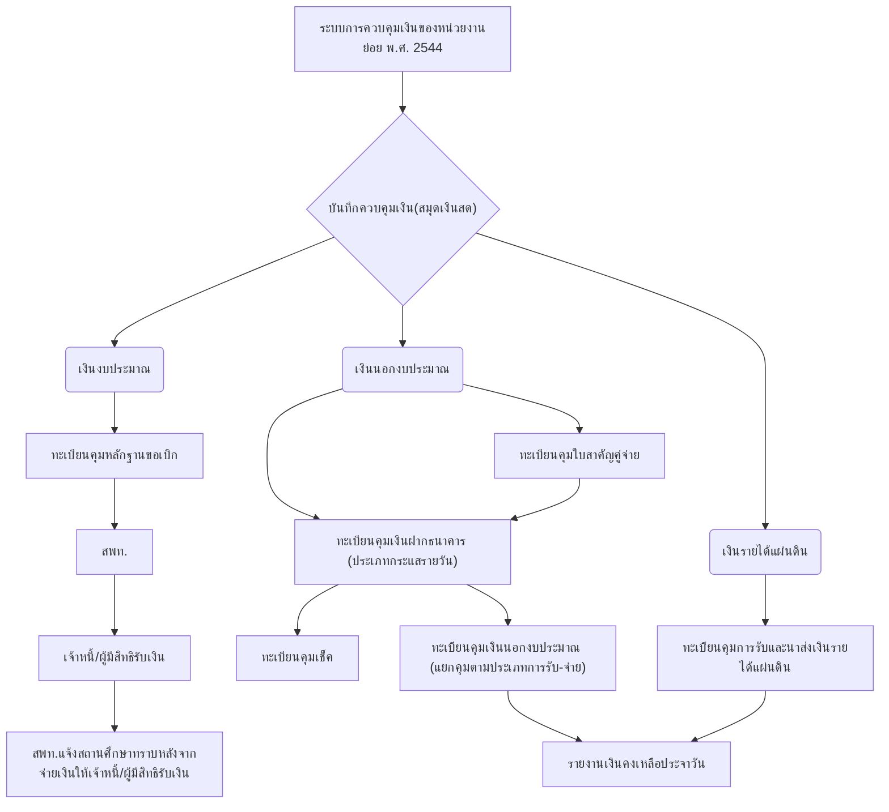

# ***คู่มือการปฏิบัติงานด้านการเงิน การบัญชี และการพัสดุของสถานศึกษา สำนักงานเขตฬื้นที่การศึกษา***

## **ระบบการควบคุมการเงินของหน่วยงานย่อย พ.ศ. 2544** 

### **หลักการและแนวคิด**
กระทรวงการคลังกำหนดระบบบัญชีหน่วยงานย่อยให้กับส่วนราชการที่มิได้เป็นส่วนราชการ ผู้เบิกตามระเบียบกระทรวงการคลังกำหนด แต่มีการจัดเก็บและนำส่งเงินรายได้แผ่นดิน และมีการเบิก เงินงบประมาณ หรือเงินนอกงบประมาณ จากส่วนราชการผู้เบิกไปใช้จ่ายโดยมิได้เบิกตรงกับ กรมบัญชีกลางหรือสำนักงานคลัง และสั่งการให้ถือปฏิบัติตามระบบบัญชีดังกล่าว ตั้งแต่ปี พ.ศ. 2515 โดยมีวัตถุประสงค์เพื่อให้ควบคุมเงินสดในความรับผิดชอบและรายงานจำนวนและประเภทเงินคงเหลือ และรวบรวมใบสำคัญส่งส่วนราชการผู้เบิก โดยบันทึกควบคุมในสมุดเงินสดแบบหลายซ่องพร้อม ทะเบียนคุมรายละเอียดที่เกี่ยวช้อง เพื่อไม่ให้เป็นภาระในการทำบัญชีกับหน่วยงานย่อยมากนัก ต่อมา ในปีงบประมาณ พ.ศ. 2544 กระทรวงการคลังได้มีการปรับปรุงระบบบัญชีดังกล่าว เป็นระบบควบคุม การเงินชองหน่วยงานย่อย ซึ่งไม่ใช่ระบบบัญชี แต่เป็นระบบที่จัดทำขึ้นเพื่อใช้ควบคุมเงินในโรงเรียน ประถมศึกษาขนาดเล็ก ที่มีการรับจ่ายเงินไม่มาก มีอัตรากำลังจำกัด ไม่มีบุคลากรที่มีคุณวุฒิทางบัญชี และมีการใช้จ่ายเงินไม่มาก ไม่ต้องมีภาระทางบัญชี เพื่อให้มีเวลากับภารกิจหลักชองหน่วยงานได้เต็มที่ กระทรวงการคลังจึงอนุญาตให้หน่วยงานย่อยที่มีลักษณะดังกล่าว ได้รับการยกเว้นไม่ต้องปฏิบัติตาม ระบบบัญชีหน่วยงานย่อย พ.ศ. 2515 โดยให้ส่วนราชการผู้เบิกรับผิดชอบจ่ายเงินเช้าบัญชีให้เจ้าหนี้ หรือผู้มีสิทธิรับเงิน'โดยตรง สำหรับหน่วยงานย่อยที่จำ เป็นต้องรับ-นำส่งเงินรายได้แผ่นดิน หรือรับ-จ่ายเงินนอกงบประมาณบางประเภทที่หน่วยงานนั้น ๆ ก็ให้มีระบบควบคุมเท่าที่จำเป็น โดยกำหนด ชอบเขตความรับผดชอบด้านการเงินชองหน่วยงานย่อย ไว้ดังนี้

- (1)    การเบิก-จ่ายเงินงบประมาณ ให้หน่วยงานย่อยรวบรวมหลักฐานการขอเบิกเงินงบประมาณ จากเจ้าหนี้หรือผู้มีสิทธิรับเงิน ส่งให้ส่วนราชการผู้เบิกตรวจสอบความถูกต้องครบถ้วนก่อนเบิกเงินจาก คลังและจ่ายเงินให้เจ้าหนี้ หรือผู้มีสิทธิรับเงินโดยตรง หรือใช้วิธีโอนเช้าบัญชีเงินฝากธนาคารชองเจ้าหนี้ หรือผู้มีสิทธิรับเงินแล้วแต่กรณี

- (2)    การรับ-นำส่งเงินรายได้แผ่นดิน ให้หน่วยงานย่อยรับและนำเงินส่งกระทรวงการคลัง หรือ สำนักงานคลังโดยตรง หรือนำฝากเช้าบัญชีฝากธนาคารชองส่วนราชการผู้เบิก และให้รายงานการรับ และส่งหรือนำฝากเงินให้ส่วนราชการผู้เบิกทราบ

- (3) การรับ-จ่ายเงินนอกงบประมาณ ให้น่าส่งหรือน่าฝากเงินเข้าบัญชีเงินฝากธนาคารของส่วน ราชการผู้เบิกและรายงานเซ่นเดียวกับรายได้แผ่นดิน สำหรับเงินนอกงบประมาณประเภทที่หน่วยงาน ย่อยรับ และสามารถเก็บไวใช้ตามวัตถุประสงค์ของเงินนอกงบประมาณนั้น ๆ ให้บันทึกควบคุมและ รายงานตามวิธีการและรูปแบบที่กำหนดในหัวข้อต่อไป

### **คำนิยาม**

**“หน่วยงานของรัฐ”** หมายความว่า ส่วนราชการ รัฐวิสาหกิจ หน่วยงานชองรัฐสภา ศาล ยุติธรรม ศาลปกครอง ศาลรัฐธรรมนูญ องค์กรอิสระตามรัฐธรรมนูญ องค์กรอัยการ องค์การมหาซนทุน หมุนเวียน'ที่มีฐานะเป็น,นิติบุคคล องค์กรปกครองส่วนท้องถิ่น และหน่วยงานอื่นของรัฐตามที่กฎหมาย กำหนด

**“หน่วยงานผู้เบิก”** หมายความว่า หน่วยงานของรัฐที่ได้รับจัดสรรงบประมาณรายจ่ายและ เบิกเงินจากกรมบัญชีกลาง หรือสำนักงานคลังจังหวัด แล้วแต่กรณี

**“ส่วนราชการ”** หมายความว่า กระทรวง ทบวง กรม หรือส่วนราชการที่เรียกซื่ออย่างอื่น และมีฐานะเป็นกรม และให้หมายความรวมถึงจังหวัดและกลุ่มจังหวัดตามกฎหมายว่าด้วยระเบียบ บริหารราชการแผ่นดินด้วย

**“องค์กรปกครองส่วนท้องถิ่น”** หมายความว่า องค์การบริหารส่วนจังหวัด เทศบาล องค์การ บริหารส่วนตำบล กรุงเทพมหานคร เมืองพัทยา และองค์ปกครองส่วนท้องถิ่นอื่นที่มืกฎหมายจัดตั้ง

**“หน่วยงานย่อย**” หมายความว่า หน่วยงานในลังกัดของส่วนราชการในราชการบริหาร ส่วนกลาง หรือในราชการบริหารส่วนภูมิภาค หรือที่ตั้งอยู่ในอำเภอ ซึ่งมิได้เบิกเงินจากกรมบัญชีกลาง หรือสำนักงานคลังจังหวัด แต่เบิกเงินผ่านราชการที่เป็นหน่วยงานผู้เบิก

**“สำนักงานการตรวจเงินแผ่นดิน”** ให้หมายความรวมถึง สำนักงานการตรวจเงินแผ่นดิน ภูมิภาค และสำนักตรวจเงินแผ่นดินจังหวัดด้วย

**“งบรายจ่าย”** หมายความว่า งบรายจ่ายตามระเบียบว่าด้วยการบริหารงบประมาณ **“หลักฐานการจ่าย”** หมายความว่า หลักฐานที่แสดงว่าได้มืการจ่ายเงินให้แก่ผู้รับ หรือเจ้าหนี้ ตามข้อผูกพันโดยถูกต้องแล้ว

**“เงินงบประมาณ”** หมายความว่า เงินที่ส่วนราชการได้รับตามพระราชบัญญัติงบประมาณ รายจ่ายประจำปี หรือเบิกจ่ายในรายจ่ายงบกลาง

**“เงินรายได้แผ่นดิน”** หมายความว่า เงินทั้งปวงที่หน่วยงานของรัฐจัดเก็บหรือได้รับไว้เป็น กรรมสิทธตามกฎหมาย ระเบียบ ข้อบังคับ หรือจากนิติกรรมหรือนิติเหตุและกฎหมายว่าด้วยเงินคงคลัง และกฎหมายว่าด้วยวินัยการเงินการคลังของรัฐ บัญญัติไม่ให้หน่วยงานของรัฐนั้นน่าไปจ่ายหรือหักไว้ เพื่อการใด ๆ

**“เงินนอกงบประมาณ”** หมายความว่า บรรดาเงินทั้งปวงที่หน่วยงานของรัฐจัดเก็บ หรือได้รับ ไว้เป็นกรรมสิทธตามกฎหมาย ระเบียบ ข้อบังคับ หรือจากนิติกรรมหรือนิติเหตุ หรือกรณีอื่นใดที่ต้อง น่าส่งคลัง แต่มีกฎหมายอนุญาตให้สามารถเก็บไว้ใช้จ่ายได้โดยไม่ต้องน่าส่งคลัง

**“เงินเบิกเกินส่งคืน”** หมายความว่า เงินงบประมาณรายจ่ายที่ส่วนราชการเบิกจากคลังไป แล้วแต่ไม่ได้จ่ายหรือจ่ายไม่หมด หรือจ่ายไปแล้วแต่ถูกเรียกคืน และได้น่าส่งคลังก่อนสิ้นปีงบประมาณ หรือก่อนสิ้นระยะเวลาเบิกเงินที่กันไว้เหลื่อมปี

**“เงินเหลือจ่ายปีเก่าส่งคืน”** หมายความว่า เงินงบประมาณรายจ่ายที่ส่วนราชการเบิกจากคลัง ไปแล้ว แต่ไม่ได้จ่ายหรือจ่ายไม่หมด หรือจ่ายไปแล้วแต่ถูกเรียกคืน และได้น่าส่งคลังภายหลังสิ้น ปีงบประมาณ หรือภายหลังระยะเวลาเบิกเงินที่กันไว้เบิกเหลื่อมปี

### **ประเภทเงินที่เกี่ยวข้องกับสถานศึกษา**

#### 1. **เงินงบประมาณ** 
เงินที่ส่วนราชการได้รับตามพระราชบัญญัติงบประมาณรายจ่ายประจำปี หรือเบิกจ่ายในรายจ่ายงบกลาง ซึ่งงบประมาณรายจ่าย จำแนกเป็น 2 ลักษณะ ได้แก่ รายจ่ายชองส่วน ราชการ รัฐวิสาหกิจ และรายจ่ายงบกลาง

**รายจ่ายของส่วนราชการและรัฐวิสาหกิจ** หมายถึง รายจ่ายซึ่งกำหนดไว้สำหรับแต่ละส่วน ราชการและรัฐวิสาหกิจโดยเฉพาะ แบ่งเป็น 5 ประเภทรายจ่าย ได้แก่
1.    งบบุคลากร
2.    งบดำเนินงาน
3.    งบลงทุน
4.    งบเงินอุดหนุน ได้แก่ เงินอุดหนุนทั่วไป เงินอุดหนุนเฉพาะกิจ
5.    งบรายจ่ายอื่น ได้แก่ ค่าใช้จ่ายในการเดินทางไปราชการต่างประเทศ

**รายจ่ายงบกลาง** หมายถึง รายจ่ายที่ตั้งไว้เพื่อจัดสรรให้ส่วนราชการและรัฐวิสาหกิจโดยทั่วไป ใช้จ่าย ตามรายการดังต่อไปนี้
1.    เงินเบี้ยหวัด บำเหน็จบำนาญ
2.    เงินเลื่อนขั้น เลื่อนอันดับเงินเดือน และเงินปรับวุฒิช้าราชการ
3.    เงินสำรอง เงินสมทบ และเงินซดเชยชองช้าราชการ
4.    เงินสมทบชองลูกจ้างประจำ
5.    ค่าใช้จ่ายสวัสดิการชองช้าราชการและลูกจ้าง

 **ระบบการควบคุมการเงินของหน่วยงานย่อย พ.ศ. 2544 กำหนดให้สถานศึกษาดำเนินการเกี่ยวกับ เงินงบประมาณ** ดังนี้
1.    ให้หน่วยงานย่อยบันทึกควบคุมการรับเอกสารหลักฐานชองเบิก (ประเภทเงินที่ฃอเบิกกับ สำนักงานเขตพื้นที่การศึกษาประถมศึกษาเชียงราย เขต 1 เซ่น งบดำเนินงาน และงบลงทุน และ รายจ่ายงบกลาง) ในทะเบียนคุมหลักฐานขอเบิก ตรวจสอบความถูกต้องในเอกสารหลักฐานแล้ววัดทำ หนังสือนำส่ง และให้หัวหน้าหน่วยงานย่อยหรือผู้ที่หัวหน้าหน่วยงานย่อยมอบหมายลงนามในหนังสือ เพื่อวัดส่งเอกสารหลักฐานดังกล่าวให้ส่วนราชการผู้เบิกโดยเร็ว เอกสารหลักฐานรายการใดส่งส่วน ราชการผู้เบิกแล้วให้หมายเหตุ ในทะเบียนคุมหลักฐานขอเบิกว่า ดำเนินการส่งให้ส่วนราชการผู้เบิกแล้ว เมื่อใด
2.    ให้เจ้าหนี้ หรือผู้มีสิทธิรับเงิน ที่ฃอเบิกเงิน ขอรับเงินจากส่วนราชการผู้เบิกโดยตรงหรือ แสดงเจตนาขอรับเงินผ่านธนาคาร ตามหนังสือกระทรวงการคลังด่วนที่สุด ที่ กค. 0530.ใ/ว 143 ลง วันที่ 22 ธันวาคม 2543 โดยวัดทำ แบบคำขอรับเงินผ่านธนาคาร เพื่อแจ้งเลขที่บัญชีเงินฝากธนาคาร ชองเจ้าหนี้หรือผู้มีสิทธิรับเงินพร้อมกับการส่งหลักฐานขอเบิก เพื่อให้ส่วนราชการผู้เบิก จ่ายเงินที่เบิก จากคลังด้วยวิธีการโอนเงินเช้าบัญชีเงินฝากธนาคารตามที่แจ้ง ทั้งนี้ค่าธรรมเนียมในการโอนให้เบีนไป ตามข้อกำหนดชองธนาคารและเบีนภาระชองเจ้าหนี้หรือผู้มีสิทธิรับเงิน
3.    ช้าราชการหรือลูกจ้างชองหน่วยงานย่อย ที่มีความประสงค์ยืมเงินเพื่อไปปฏิบัติราชการให้ ทำสัญญายืมเงินจากส่วนราชการผู้เบิกโดยตรง เมื่อเดินทางกลับจากราชการแล้วให้ผู้ยืมส่งใช้ใบสำคัญ และหรือเงินสดคงเหลือซดใช้สัญญาการยืมเงินกับส่วนราชการผู้เบิก

#### 2. **เงินรายได้แผ่นดิน** 
เงินที่ส่วนราชการจัดเก็บ หรือได้รับไว้เป็นกรรมสิทธตามกฎหมาย ระเบียบ ข้อบังคับ หรือจากนิติกรรมหรือจากนิติเหตุ และไม่มีกฎหมายอื่นใดกำหนดให้ส่วนราชการเก็บ ไว้หรือหักไว้เพื่อจ่าย ได้แก่

1.    ดอกเบี้ยจากบัญชีเงินฝากธนาคารชองเงินอุดหนุนทั่วไป และจากบัญชีเงินฝากธนาคาร โครงการอาหารกลางจัน (รับจากองค์กรปกครองส่วนท้องถิ่น : อปท.)
2.    ค่าขายชองชำรุดที่จัดหาจากเงินงบประมาณ
3.    ค่าขายแบบรูปรายการที่จัดหาจากเงินงบประมาณ
4.    เงินเหลือจ่ายปีเก่าส่งคืน ได้แก่ เงินงบประมาณที่เรืยกคืน เนื่องจากจ่ายเกินสิทธิ และได้รับคืนภายหลังสิ้นปีงบประมาณ

**ระบบการควบคุมการเงินของหน่วยงานย่อย พ.ศ. 2544 กำหนดให้สถานศึกษา ดำเนินการ เกี่ยวกับเงินรายได้แผ่นดิน** ดังนี้

1.    ให้หน่วยงานย่อยที่มีการจัดเก็บเงินรายได้แผ่นดินออกใบเสร็จรับเงินให้ผู้ชำระเงินตามปกติ และให้มีการบันทึกควบคุมรายการในทะเบียนคุมการรับและนำส่งเงินรายได้แผ่นดิน เพื่อประโยชน์ใน การจัดทำรายงานส่งส่วนราชการผู้เบิก ยกเว้น เงินดอกเบี้ยจากบัญชีเงินฝากธนาคาร สถานศึกษาไม่ ต้องออกใบเสร็จรับเงิน
2.    การนำเงินรายได้แผ่นดินส่งคลัง แยกเป็น 2 กรณี ดังบี้
2.1    กรณีที่หน่วยงานย่อยที่มีหน้าที่หลักในการจัดเก็บรายได้แผ่นดินหรือโดยหน้าที่ทำให้มี การจัดเก็บรายได้แผ่นดินโดยสมํ่าเสมอให้ทำใบนำส่งเงินรายได้แผ่นดินและนำเงินที่จัดเก็บได้ ส่งคลัง โดยตรงพร้อมกับส่งคู่ฉบับใบนำส่งเงินรายได้แผ่นดินให้ส่วนราชการผู้เบิกบันทึกรายการบัญชีต่อไป
2.2    กรณีที่หน่วยงานย่อยมีการจัดเก็บเงินรายได้แผ่นดินเป็นครั้งคราว และมีจำนวนเงินไม่ มากให้นำเงินที่จัดเก็บได้ฝากเข้าบัญชีเงินฝากธนาคารชองส่วนราชการผู้เบิกที่เปีดเพื่อการบี้ หรือนำเงิน ส่งคลังโดยตรง และส่งลำเนาใบนำฝากหรือคู่ฉบับใบนำส่งเงินรายได้แผ่นดินให้ส่วนราชการผู้เบิกพร้อม รายงานการรับและนำส่งเงินรายได้แผ่นดินที่หน่วยงานย่อยจัดเก็บ หากยังมิได้นำส่งคลังหรือนำฝากเข้า บัญชีส่วนราชการผู้เบิก จำนวนเงินดังกล่าวอาจจะนำฝากธนาคารในบัญชีประเภทกระแสรายจัน ใน นามชองหน่วยงานย่อยไว้ก่อน แล้วจึงจะเชียนเช็คสั่งจ่ายเพื่อนำส่งคลังหรือนำฝากเข้าบัญชีเงินฝาก ธนาคารของส่วนราชการผู้เบิกต่อไป หากเงินที่นำส่งไม่เกิน 1,000 บาท จะนำส่งเป็นเงินสดก็ได้ ในกรณี ที่นำส่งส่วนราชการผู้เบิกให้หัวหน้าหน่วยงานย่อยลงนามในหนังสือเพื่อนำส่งเงินให้ส่วนราชการผู้เบิก
3. ทุกวันสิ้นเดือน กรณีส่งเงินเข้าคลังโดยตรง หรือทุกวันที่ 15 กรณีส่งเงินเข้าบัญชีส่วน ราชการผู้เบิก ให้สถานศึกษาหน่วยงานย่อย สรุปข้อมูลการรับและนำส่ง หรือนำฝากจากทะเบียนคุม การรับและนำส่งเงินรายได้แผ่นดิน เพื่อจัดทำรายงานการรับและนำส่งหรือนำฝากจำนวน 2 ฉบับ ส่งให้ ส่วนราชการผู้เบิก 1 ฉบับ สำเนาเก็บไว้เป็นหลักฐาน 1 ฉบับ สำหรับหน่วยงานย่อยที่นำเงินที่จัดเก็บได้ ฝากเข้าบัญชีเงินฝากธนาคารของส่วนราชการผู้เบิก ให้แนบสำเนาใบนำฝากไปด้วย ทั้งนี้ ยกเว้นการ จัดทำงบเดือนเงินรายได้แผ่นดินของหน่วยงานย่อยตามหนังสือกระทรวงการคลังที่ กค 0530/55103 ลงวันที่ 29 ตุลาคม 2539

#### 3.  **เงินนอกงบประมาณ**
เงินนอกงบประมาณที่สถานศึกษาได้รับและสามารถเก็บไว้ใช้จ่ายได้ได้แก่

1.    เงินรายได้สถานศึกษา
2.    เงินสนับสนุนโครงการอาหารกลางวัน (งบองค์กรปกครองส่วนห้องถิ่น : อปท./เทศบาล/อบต.)
3.    เงินลูกเสือ/เงินเนตรนารี/เงินยุวกาชาด

เงินนอกงบประมาณที่สถานศึกษาได้รับไว้แต่ต้องจ่ายคืนผู้มีสิทธิเมื่อถึงกำหนด และนำส่งตาม ระเบียบกำหนด ได้แก่
1.    เงินประกันสัญญา
2.    เงินภาษีหัก ณ ที่จ่าย

*ในส่วนนของเงินอุดหนุนที่สถานศึกษาได้รับตามโครงการสนับสนุนค่าใช้จ่ายในการจัดการศึกษา ตั้งแต่ระดับอนุบาลจนจบการศึกษาขั้นพื้นฐาน จำนวน 5 รายการ ได้แก่ ค่าจัดการเรียนการสอน (เงินอุดหนุนค่าใช้จ่ายรายหัว/เงินอุดหนุนปัจจัยพื้นฐานนักเรียนยากจน) ค่าหนังสือเรียน ค่าอุปกรณ์การเรียน ค่าเครื่องแบบนักเรียน และค่ากิจกรรมพัฒนาคุณภาพผู้เรียน **ซึ่งเป็นเงินงบประมาณ**ที่สำนักงานคณะกรรมการการศึกษาขั้นพื้นฐานโอนให้เพื่อใช้สำหรับจัดการเรียนการสอนนั้น ให้สถานศึกษาควบคุมเงินในลักษณะของเงินนอกงบประมาณ*

**ระบบควบคุมการเงินของหน่วยงานย่อย พ.ศ. 2544 กำหนดให้สถานศึกษาดำเนินการเกี่ยวกับเงิน นอกงบประมาณ** ดังนี้
1.    การรับและน่าส่งหรือน่าฝากเงินนอกงบประมาณให้ปฏิบัติทำนองเดียวกับเงินรายได้แผ่นดิน การน่าเงินนอกงบประมาณฝากส่วนราชการผู้เบิกเป็นเงินสด ให้หัวหน้าหน่วยงานย่อยหรือผู้ที่หัวหน้า หน่วยงานย่อยมอบหมายลงนามในหนังสือเพื่อน่าฝาก สำหรับการเบิกจ่ายเงินนอกงบประมาณให้ ปฏิบัติเซ่นเดียวกับการเบิกจ่ายเงินงบประมาณ
2.    เงินนอกประมาณประเภทเงินฝาก ซึ่งจะต้องจ่ายคืนเมือถึงกำหนดเวลา ให้จัดทำทะเบียน คุมเงินนอกงบประมาณ ประเภท “เงินฝาก” เพื่อบันทึกรายละเอียดข้อมูลและเมื่อครบกำหนดจ่ายคืน ให้ทำหนังสือแจ้งส่วนราชการผู้เบิกคืนเงินให้ผู้มืสิทธิรับเงินโดยตรงหรือจ่ายโอนเงินเข้าบัญชีเงินฝาก ธนาคารชองผู้มืสิทธิพร้อมทั้งให้หมายเหตุในทะเบียนดังกล่าวและลดยอดในสมุดคู่ฝากด้วย เงินนอก งบประมาณที่หน่วยงานย่อยฝากส่วนราชการผู้เบิก การฝากและการถอนเงินให้ผู้เบิกลงลายมือซื่อการ รับฝากและถอนเงิน
3.    การจ่ายเงินทดรองราชการให้ข้าราชการยืมหรือรองจ่ายค่าใช้จ่ายตามระเบียบเงินทดรอง ราชการ ให้บันทึกควบคุมในทะเบียนคุมเงินทดรองราชการ การเบิกเงินงบประมาณซดใช้เงินทดรอง ราชการ ให้หัวหน้าหน่วยงานย่อยหรือผู้ที่ห้วหน้าหน่วยงานย่อยมอบหมายลงนามในหนังสือเพื่อส่ง เอกสารหลักฐานให้ส่วนราชการผู้เบิกโดยไม่ต้องจัดทำใบเบิกเงินงบประมาณ หน่วยงานย่อยใดที่ไม่มืเงิน ทดรองราชการ หรือมืแต่ไม่เพียงพออาจจะน่าเงินนอกงบประมาณมารองจ่ายทำนองเดียวกับเงินทดรอง ราชการก็ได้
4.    สำหรับเงินนอกงบประมาณประเภทที่หน่วยงานย่อยรับและสามารถเก็บไวใช้จ่ายเองซึ่ง อาจจะอยู่ในรูปแบบเงินสด หรือเงินฝากธนาคารในบัญชีชองหน่วยงานย่อย หรือฝากส่วนราชการผู้เบิก ให้บันทึกควบคุมการรับ-จ่ายในทะเบียนคุมเงินนอกงบประมาณ (ระบุประเภท) แล้วแต่กรณีซึ่งสามารถ เก็บข้อมูลเพื่อจัดทำรายงานส่งให้ส่วนราชการผู้เบิก หรือหน่วยงานที่เกี่ยวข้องตามระเบียบหรือหนังสือ สั่งการที่เกี่ยวข้องได้ตามความต้องการ
5.    การถอนเงินนอกงบประมาณที่ฝากส่วนราชการผู้เบิก ให้ทำใบเบิกถอนเงินฝากพร้อมสมุดคู่ ฝาก สำหรับการรับเงินตามใบเบิกถอนเงินฝากชองหน่วยงานย่อย อาจขอรับเงินโดยวิธีโอนเงินเข้าบัญชี เงินฝากธนาคารชองหน่วยงานก็ได้ การปฏิบัติเกี่ยวกับรายงานการรับและน่าส่งหรือน่าฝากให้ถือปฏิบัติ ทำนองเดียวกับเงินรายได้แผ่นดิน

### **การเก็บรักษาเงิน**
ทุกสิ้นวันให้เจ้าหน้าที่ผู้รับผิดชอบสรุปยอดเงินคงเหลือแต่ละประเภทที่ปรากฏในทะเบียน ต่าง ๆ เพื่อจัดทำรายงานเงินคงเหลือประจำวัน เสนอคณะกรรมการเก็บรักษาเงินที่หัวหน้าหน่วยงาน แต่งตั้ง โดยจำนวนเงินคงเหลือที่ปรากฏในรายงานดังกล่าวจะประกอบด้วย
1.    รายงานเงินสด จะต้องเท่ากับตัวเงินสด เช็ค หรือธนาณัติ ที่ตรวจนับได้
2.    รายการเงินฝากธนาคาร จะต้องเท่ากับยอดที่ปรากฏในบัญชีเงินฝากธนาคารประเภทออมทรัพย์ และประเภทกระแสรายวัน (สำหรับบัญชีกระแสรายวันให้มีการท่างบเทียบยอดบัญชีเงินฝาก ธนาคารทุกสิ้นเดือนด้วย)
3.    รายการเงินฝากส่วนราชการผู้เบิก จะต้องเท่ากับยอดที่ปรากฏในสมุดคู่ฝาก เมื่อกรรมการ เก็บรักษาเงินลงนามในรายงานดังกล่าวให้น่าเงินสด เช็คหรือธนาณัติเก็บเช้าตู้นิรภัยชองหน่วยงาน กรณี ที่'โม่มีตู้'นิรภัย ให้จัดท่าและบันทึกรายการในแบบบันทึกการรับเงินเพื่อเก็บรักษา แล้วเสนอรายงานให้ หัวหน้าหน่วยงานย่อยลงนามต่อไป ในกรณีที่วันใดไม่มีการรับ-จ่ายเงิน ก็ให้จัดท่ารายงานเงินคงเหลือ ประจำวัน และหมายเหตุในรายงานว่าไม่มีการรับ-จ่ายเงิน และทุกสิ้นเดือน ให้สำเนารายงานเงิน คงเหลือประจำวัน ณ วันท่าการสุดท้ายชองเดือนให้ส่วนราชการผู้เบิกทราบด้วย สำหรับวงเงินเก็บ รักษาชองเงินแต่ละประเภท ให้เบีนไปตามข้อกำหนดในเรื่องนั้น ๆ

### **การควบคุมและการตรวจสอบ**

เพื่อให้การดำเนินการชองสถานศึกษาที่เปีนหน่วยงานย่อย เปีนไปอย่างถูกต้องมีการตรวจสอบ การปฏิบัติงาน โดยให้หัวหน้าหน่วยงานย่อยหรือผู้ที่หัวหน้าหน่วยงานย่อยมอบหมายดำเนินการ ดังนี้
1.    ตรวจสอบการส่งเอกสารหลักฐานในทะเบียนคุมหลักฐานขอเบิกว่า ได้มีการส่งหลักฐานให้ ส่วนราชการผู้เบิกครบถ้วนทุกรายการ เปีนไปตามลำดับก่อนหลังหรือไม่
2.    ทุกสิ้นวันท่าการให้ตรวจสอบการบันทึกการเคลื่อนไหวในทะเบียนต่าง ๆ ซึ่งจำนวนเงินรวม ชองเงินแต่ละประเภทที่หน่วยงานย่อยได้รับ หักจำนวนเงินที่นำส่งหรือนำฝากในวันนั้นจะเปีนยอดที่ แสดงไวในรายงานคงเหลือประจำวันตามประเภทเงิน
สำหรับหน่วยงานย่อยที่มีเงินทดรองราชการ ให้ตรวจสอบการเคลื่อนไหวในทะเบียนรับ-จ่ายเงินทดรองราชการ ว่ารายการต่าง ๆ ดังกล่าวมีเอกสารหลักฐานครบถ้วนหรือไม่ และมีจำนวนเงิน คงเหลือถูกต้องหรือไม่
3. ทุกวันที่ 15 และวันสิ้นเดือนแล้วแต่กรณีให้ตรวจสอบความถูกต้องชองข้อมูลในรายการรับ และน่าส่งหรือน่าฝากกับสำเนาใบเสร็จรับเงินและคู่ฉบับใบน่าส่งหรือสำเนาใบน่าฝากก่อนส่งให้ส่วน ราชการผู้เบิก

ทั้งนี้ หากมีการรับ-จ่ายเงินที่หน่วยงาน หน่วยงานย่อยจะต้องสรุปและทำรายงานเงินคงเหลือ ประจำวัน เสนอคณะกรรมการเก็บรักษาเงิน และรายงานให้หัวหน้าหน่วยงานทราบ พร้อมนี้ให้สำเนา รายงานเงินคงเหลือประจำวัน ณ วันสิ้นเดือนให้ส่วนราชการผู้เบิกทราบด้วย เพื่อประโยชน์ในการ ตรวจสอบกำกับดูแล รวมทั้งจะต้องทำรายงานการรับ-น่าส่งเงินรายได้แผ่นดิน และรายงานการรับ-จ่ายเงินนอกงบประมาณ ส่งให้ส่วนราชการผู้เบิกตามระยะเวลา รูปแบบที่กำหนดในระบบนี้ หรือที่ กำหนดในระเบียบ หรือหนังสือสั่งการชองระบบเงินนอกงบประมาณที่เกี่ยวข้องด้วย

### **ผังกระบวนการปฏิบัติงานด้านการเงิน การบัญชีในสถานศึกษา**

### **เอกสารทางการเงิน**

1.    **เอกสารด้านรับ** ได้แก่
1.1. สำเนาใบเสร็จรับเงิน เป็นเอกสารที่เกิดจากสถานศึกษาออกใบเสร็จรับเงินเมื่อได้รับเงิน ประเภทต่าง ๆ
1.2. คู่ฉบับใบเบิกถอนเงินฝาก ***(เอกสารหมายเลข 1)*** เป็นเอกสารที่สถานศึกษาจัดทำเพื่อ ขอเบิกถอนเงินที่น่าฝากเงินกับสำนักงานเขตพื้นที่การศึกษาประถมศึกษาเชียงราย เขต 1
1.3. สมุดคู่ฝากธนาคารหรือสมุดบัญชีเงินฝากธนาคาร ใช้เป็นหลักฐานรับเงินกรณี สถานศึกษาได้รับโอนเงินเช้าบัญชีธนาคาร
1.4. คู่ฉบับหนังสือรับรองการหักภาษี ณ ที่จ่าย (แบบ บก.28 หรือแบบ 4235) ตามแบบที่ กระทรวงการคลังกำหนด ***(เอกสารหมายเลข 2)*** เป็นหลักฐานการรับฝากเงินภาษีเพื่อรอน่าส่งให้ สำนักงานสรรพากร ในกรณีสถานศึกษาจ่ายเงินให้แก่เจ้าหนี้และหักภาษี ณ ที่จ่ายไว้ตามกฎหมาย กำหนด

2.    **เอกสารด้านจ่าย** ได้แก่
2.1. ใบเสร็จรับเงินของสำนักงานเขตพื้นที่การศึกษา เป็นเอกสารหลักฐานที่สถานศึกษาได้รับ กรณีน่าเงินรายได้แผ่นดินส่งคลัง โดยผ่านสำนักงานเขตพื้นที่การศึกษา
2.2. ใบน่าฝาก ***(เอกสารหมายเลข3)*** เป็นเอกสารหลักฐานที่สถานศึกษาจัดทำขึ้นกรณีน่า เงินนอกงบประมาณฝากคลัง โดยผ่านสำนักงานเขตพื้นที่การศึกษา 
2.3. หลักฐานการจ่าย ซึ่งประกอบด้วย
2.3.1. หลักฐานต้นเรื่อง โครงการ หรือหลักฐานดำเนินการตามระเบียบที่เกี่ยวช้อง กำหนด ได้แก่ หลักฐานการจัดซื้อจัดจ้างตามพระราชบัญญัติการจัดซื้อจัดจ้างและการบริหารพัสดุ ภาครัฐ พ.ศ. 2560 ระเบียบกระทรวงการคลังว่าด้วยการจัดซื้อจัดจ้างและการบริหารพัสดุภาครัฐ พ.ศ. 2560 หรือหลักฐานตามระเบียบค่าใช้จ่ายในการเดินทางไปราชการ หรือหลักฐานตามระเบียบ ค่าใช้จ่ายในการ'ฝืกอบรม และค่าใช้จ่ายในการจัดงานสำหรับหน่วยงานในสังกัดสำนักงาน คณะกรรมการการศึกษาขั้นพื้นฐาน ฯลฯ
2.3.2. ใบสำคัญคู่จ่าย ซึ่งได้แก่ใบเสร็จรับเงินจากผู้ประกอบการ/เจ้าหนี้หรือผู้มีสิทธิ รับเงิน หรือใบเสร็จรับเงินของส่วนราชการที่เกี่ยวช้องกับการชำระเงิน และหรือใบสำคัญรับเงิน ***(เอกสารหมายเลข 4)***

### **ทะเบียนคุมที่เกี่ยวข้อง** **กับการปฏิบัติงานของสถานศึกษา** ประกอบด้วย
1. **ทะเบียนคุมหลักฐานขอเบิก** ***(เอกสารหมายเลข 5)*** ใช้สำหรับบันทึกควบคุมหลักฐานขอ เบิกได้แก่ หลักฐานขอเบิกเงินค่ารักษาพยาบาล ค่าการศึกษาบุตร เพื่อควบคุมมิให้หลักฐานสูญหายและ ช่วยให้ดำเนินการขอเบิกเงินเปีนไปตามลำดับก่อนหลัง
2. **ทะเบียนคุมเงินงบประมาณ** ***(เอกสารหมายเลข 6)*** ใช้สำหรับการควบคุมการรับจ่ายเงิน งบประมาณที่ขอเบิกจากสำนักงานเขตพื้นที่การศึกษา ต้นลังกัด
3. **ทะเบียนคุมเงินฝากธนาคาร ประเภทกระแสรายวัน** ***(เอกสารหมายเลข 7)*** ใช้บันทึกเพื่อ ควบคุมการฝาก - ถอนเงินฝากธนาคาร ของสถานศึกษา
4. **ทะเบียนคุมเงินนอกงบประมาณ** ***(เอกสารหมายเลข 8)*** ใช้สำหรับการบันทึกควบคุมการ รับและจ่ายเงินนอกงบประมาณ โดยบันทึกแยกตามประเภทของเงิน ได้แก่ เงินค่าจัดการเรียนการสอน กรณีไม่มีการยืมเงิน (รายการเงินอุดหนุนค่าใช้จ่ายรายหัว, เงินบิจจัยพื้นฐานนักเรียนยากจน, เงิน ค่าอาหารสำหรับนักเรียนพักนอน) กรณีบันทึกการให้ยืมเงิน ***(เอกสารหมายเลข 8/1)*** เงินค่าหนังสือแบบเรียน, เงินค่าอุปกรณ์การเรียน ***(เอกสารหมายเลข 8/2),*** เงินค่าเครื่องแบบนักเรียน, เงินค่ากิจกรรมพัฒนาคุณภาพผู้เรียน ***(เอกสารหมายเลข 8/3),*** เงินภาษีหัก ณ ที่จ่าย ***(เอกสารหมายเลข 8/4)*** เงินรายได้สถานศึกษา ***(เอกสารหมายเลข 8/5)*** (บันทึกแยกตามเงินที่ได้รับ เช่น เงินบริจาคโดยมี วัตถุประสงค์, เงินบริจาคโดยไม่ระบุวัตถุประสงค์, และเงินบูรณะทรัพย์สิน ฯลฯ) กรณีเงินโครงการ อาหารกลางวัน (รับจาก อปท.) ให้บันทึกควบคุมการรับจ่ายเงินตามแบบทะเบียนคุมเงินค่าจัดการเรียน การสอน ***(เอกสารหมายเลข 8 หรือ แบบ 8/1)***
5. **ทะเบียนคุมการรับและนำส่งเงินรายได้แผ่นดิน** ***(เอกสารหมายเลข 9)*** ใช้สำหรับการ บันทึกควบคุมการรับและนำส่งเงินรายได้แผ่นดิน โดยทะเบียนคุมมีช่องหลายช่องให้บันทึกแยกตาม ประเภทของเงินรายได้แผ่นดินที่ได้รับ
6. **สมุดคู่ฝาก** ***(เอกสารหมายเลข 10)*** ใช้สำหรับบันทึกควบคุมการฝากเงินนอกงบประมาณ กับสำนักงานเขตพื้นที่การศึกษา (ส่วนราชการผู้เบิก) และควบคุมการถอนเงินที่นำฝาก ได้แก่ เงิน ประกันสัญญา ฝากทั้งจำนวน และหรือเงินรายได้สถานศึกษา เงินอุดหนุนที่ได้รับจากองค์กรปกครอง ส่วนห้องถิ่น (เงินส่วนเกินอำนาจการเก็บรักษาเงินของสถานศึกษา)
7. **ทะเบียนคุมเงินนอกงบประมาณ- เงินฝาก** ***(เอกสารหมายเลข 11)*** ใช้สำหรับบันทึก ควบคุมการรับและน่าฝากเงินนอกงบประมาณประเภทที่ต้องจ่ายคืนให้แก่ผู้มีสิทธิเมื่อถึงกำหนด ได้แก่ เงินรับฝากประกันสัญญา
8. **ทะเบียนคุมการจ่ายเช็ค** ***(เอกสารหมายเลข 12)*** ใช้'บันทึกการควบคุมการ'จ่ายเช็ค,ให้กับ เจ้าหนี้/ผู้มีสิทธิรับเงิน

### **การจัดทำรายงานการเงิน**

รายงานการเงินที่สถานศึกษาต้องจัดทำและรายงานให้หน่วยงานที่เกี่ยวช้องทราบ ประกอบด้วย ดังนี้

1. **รายงานเงินคงเหลือประจำวัน** ***(เอกสารหมายเลข 13)*** ทุกสิ้นวันให้เจ้าหน้าที่ผู้รับผิดชอบ ดำเนินการ โดย
- 1.1. สรุปเงินคงเหลือแต่ละประเภทตามระเบียนคุมต่าง ๆ จัดทำรายงานเงินคงเหลือ ประจำวัน โดยจำนวนเงินคงเหลือที่ปรากฏในรายงานประกอบด้วย
-- 1)    รายการเงินสด ต้องเท่ากับตัวเงินสด เช็ค หรือธนาณัติ ที่ตรวจนับได้
-- 2)    รายการเงินฝากธนาคาร ต้องเท่ากับยอดที่ปรากฏในบัญชีเงินฝากธนาคารที่อยู่ใน ความรับผิดชอบทุกเล่ม
-- 3)    รายการเงินฝากส่วนราชการผู้เบิก ต้องเท่ากับยอดที่ปรากฏในสมุดคู่ฝาก
- 1.2 เสนอรายงานเงินคงเหลือประจำวันพร้อมทั้งเงินสด เช็ค ธนาณัติ ให้กรรมการเก็บรักษา เงินตรวจสอบ เมื่อกรรมการตรวจสอบและลงนามในรายงานแล้วให้น่าเงินสด เช็ค หรือธนาณัติเก็บในตู้ นิรภัย
** กรณีที่สถานศึกษาไม่มีตู้นิรภัย การเก็บรักษาเงินสดคงเหลือดำเนินการโดยให้เจ้าหน้าที่ ผู้รับผิดชอบจัดท่า “บันทึกการรับเงินเพื่อเก็บรักษา” ตามจำนวนเงินและตามประเภทชองเงินเสนอให้ ผู้อำนวยการสถานศึกษาลงนาม พร้อมทั้งน่าเงินมอบให้ผู้อำนวยการสถานศึกษารับไปเก็บรักษา **
- 1.3 เสนอรายงานเงินคงเหลือประจำวันให้ผู้อำนวยการสถานศึกษารับทราบ และลงนาม กรณีวันใดไม่มีการรับ-จ่ายเงินก็ไม่ต้องจัดท่ารายงานคงเหลือประจำวัน แต่ให้หมายเหตุในรายงานเงิน คงเหลือประจำวันฉบับสุดท้ายว่า “ระหว่างวันที่ XX ถึงวันที่XX ไม่มีการรับจ่ายเงิน”
** ตามระบบการควบคุมการเงินของหน่วยงานย่อย พ.ศ. 2544 กำหนด เมื่อกรรมการ เก็บรักษาเงินลงนามในรายงานเงินคงเหลือประจำวันแล้ว ให้นำเงินสด เช็ค หรือธนาณัติเก็บเข้าตู้นิรภัย แล้วเสนอรายงานให้หัวหน้าหน่วยงานย่อยลงนามต่อไป ***ในกรณีที่วันใดไม่มีการรับ*** - ***จ่ายเงิน ก็ให้ จัดทำรายงานเงินคงเหลือประจำวัน และหมายเหตุในรายงานว่าไม่มีการรับ*** - ***จ่ายเงิน***

2. **รายงานประจำเดือน**
สถานศึกษาจัดส่งรายงานการเงินให้สำนักงานเขตพื้นที่การศึกษาประถมศึกษาเขียงราย เขต 1 ทราบ เพื่อการตรวจสอบและกำกับดูแล ได้แก่
- 2.1    รายงานการเงินประจำเดือน ประกอบด้วยสำเนารายงานเงินคงเหลือประจำวัน ณ วันที่ ทำการสุดท้ายของเดือนส่งภายในวันที่ 15 ของเดือนถันไป
- 2.2    รายงานงบเทียบยอดเงินฝากธนาคาร (ประเภทกระแสรายวัน) ***(เอกสารหมายเลข 14)***
- 2.3    รายงานการรับและนำส่งเงินรายได้แผ่นดิน ให้สถานศึกษาจัดทำรายงาน กรณี สถานศึกษานำส่งเงินรายได้แผ่นดินเข้าสำนักงานคลังโดยตรง หรือกรณีสถานศึกษานำส่งเงินรายได้ แผ่นดินเข้าบัญขีเงินฝากธนาคารของสำนักงานเขตพื้นที่การศึกษาประถมศึกษาเขียงราย เขต 1

3. **รายงานอื่น ๆ**
รายงานอื่น ๆ ที่สถานศึกษาจัดทำและส่งให้ส่วนราชการผู้เบิกตามระยะเวลาและรูปแบบที่ กำหนดในระเบียบหรือหนังลือสั่งการของระบบเงินนอกงบประมาณที่เกี่ยวข้อง ได้แก่
- 3.1 รายงานการรับ-จ่ายเงินรายได้สถานศึกษาประจำปีงบประมาณ ***(เอกสารหมายเลข 15)***
* 1)    ให้เก็บรายละเอียดการรับจ่ายเงินจากทะเบียนคุมเงินนอกงบประมาณ ประเภทเงิน รายได้สถานศึกษา และจัดทำรายงานการรับ-จ่ายเงินรายได้สถานศึกษาประจำปีงบประมาณโดยแสดง ยอดยกมาจากปีงบประมาณที่ผ่านมา บวกกับ รายรับที่ได้รับโดยแยกตามประเภทของเงิน หักด้วย รายจ่ายที่เกิดโดยแยกตามหมวดรายจ่าย ผลต่างเปีนยอดคงเหลือยกไป
* 2)    เสนอรายงานให้คณะกรรมการสถานศึกษาขั้นพื้นฐานและสำนักงานเขตพื้นที่ การศึกษาประถมศึกษาเขียงราย เขต 1 ทราบภายใน 30 วันนับแต่วันสิ้นปีงบประมาณ
- 3.2    รายงานผลการดำเนินงานกองทุนโรงเรียนประซารัฐ
สำหรับสถานศึกษาที่เป็นโรงเรียนประซารัฐให้รายงานผลการดำเนินงานตามแบบที่ ระเบียบสำนักงานคณะกรรมการการศึกษาขั้นพื้นฐาน ว่าด้วยกองทุนสานพลังประซารัฐ : โรงเรียน ประซารัฐ พ.ศ.2559 และคู่มือกองทุนโรงเรียนประซารัฐสำนักงานคณะกรรมการการศึกษาขั้นพื้นฐาน กำหนดดังนี้
* 1)    รายงานผลการดำเนินงานกองทุนให้คณะกรรมการบริหารเงินกองทุนโรงเรียน ประซารัฐทราบ ดังนี้
-- ให้สถานศึกษาจัดทำรายงานผลการดำเนินงานกองทุน(แบบ ปซร.1)โดย รายงานผลการดำเนินงานแยกตามแผนงาน/โครงการ/กิจกรรม พร้อมทั้งบีญหาอุปสรรค ***(เอกสาร หมายเลข 16)***
-- เสนอต่อคณะกรรมการบริหารกองทุนโรงเรียนเพื่อพิจารณาภายใน 15 จันนับ จากจันสิ้นภาคเรียนเพื่อให้คณะกรรมการบริหารกองทุนโรงเรียนรายงานผลต่อคณะกรรมการซับเคลื่อน โครงการโรงเรียนประซารัฐซองสำนักงานเซตพื้นที่การศึกษาประถมศึกษาเซียงราย เซต 1 ภายใน 30 จันนับจากจันสิ้นภาคเรียน
- 2)    รายงานการรับ-จ่ายเงินกองทุนโรงเรียนประซารัฐ
-- ให้คณะกรรมการบริหารกองทุนโรงเรียนจัดทำรายงานการรับ-จ่ายเงินกองทุนใน โรงเรียนประซารัฐ (แบบ ปซร. 2) ***(เอกสารหมายเสข 17)*** โดยรายงาน'ให้แสดงยอดยกมาต้นัปีบ'วกกับ รายรับที่ได้ตั้งแต่ต้นปีโดยแยกตามประเภทซองเงิน หักด้วยรายจ่ายที่เกิดตั้งแต่ต้นปีโดยแยกตามหมวด รายจ่ายผลต่างเป็นยอดคงเหลือยกไป
-- เสนอรายงานต่อคณะกรรมการซับเคลื่อนโครงการโรงเรียนประซารัฐซองสำนักงาน เซตพื้นที่การศึกษาเป็นรายไตรมาส

- 3.3    รายงานตามมาตรการแกิไฃบีญหาหนี้ค่าสาธารณูปโภคค้างชำระของส่วนราชการ โดยให้สถานศึกษารายงานข้อมูลค่าสาธารณูปโภคผ่านเว็บไซต์ http://e-budget.jobobec.in.th/ ให้ ถูกต้อง ครบถ้วน และเป็นปัจจุบัน (ตามหนังลือสำนักงานคณะกรรมการการศึกษาขั้นพื้นฐาน ด่วนที่สุด ที่ ศธ 04006/ว 157 ลงจันที่ 14 มกราคม 2563 เรื่อง การลดค่าใช้จ่ายด้านสาธารณูปโภคของหน่วยงานภาครัฐ) สำหรับการเข้าสู่ระบบสถานศึกษา ให้เลือกรายงานค่าสาธารณูปโภค เพื่อตรวจสอบและวิเคราะห์ผลการค่าใช้จ่ายเงินค่าสาธารณูปโภค หนี้ค้างชำระค่าสาธารณูปโภคให้เป็นไปตามมติคณะรัฐมนตรี เมื่อวันที่ 6 มิถุนายน 2560 และตามหนังสือสำนัก เลขาธิการคณะรัฐมนตรี ด่วนที่สุด ที่ นร 0505/ว 523 ลงวันที่ 19 ธันวาคม 2562 เรื่อง ลดค่าใช้จ่าย ด้านสาธารณูปโภคของหน่วยงานภาครัฐ เมื่อสถานศึกษารายงานข้อมูลในระบบถูกต้อง ครบถ้วน และ เป็นปัจจุบัน หน่วยตรวจสอบภายในจะได้ตรวจสอบการใช้จ่ายค่าสาธารณูปโภคของส่วนราชการทั้งจากเงินในงบประมาณและเงินนอกงบประมาณ ให้เป็นไปตามมาตรการ และจะได้รายงานให้สำนักงานคณะกรรมการการศึกษาขั้นพื้นฐานทราบ ตามระยะเวลาที่กำหนด ดังนี้
- ไตรมาสที่ 1 (เดือนตุลาคม - ธันวาคม) รายงานภายในวันที่ 25 มกราคม
- ไตรมาสที่ 2 (เดือนมกราคม - มีนาคม) รายงานภายในวันที่ 25 เมษายน
- ไตรมาสที่ 3 (เดือนเมษายน - มิถุนายน) รายงานภายในวันที่ 25 กรกฎาคม 
- ไตรมาสที่ 4 (เดือนกรกฎาคม - กันยายน) รายงานภายในวันที่ 25 ตุลาคม

## **การบริหารงบประมาณของสถานศึกษา**

ตามระเบียบกระทรวงการคลังว่าด้วยการเบิก เงินจากคลัง การรับ เงิน การจ่าย เงิน การเก็บ รักษาเงินและการน่าเงินส่งคลัง พ.ศ. 2562 ได้ให้คำจำกัดความของ “หน่วยงานย่อย” หมายถึง หน่วยงานในสังกัดส่วนราชการในราชการบริหารส่วนกลาง หรือในราชการบริหารส่วนภูมิภาค หรือที่ตั้ง อยู่ในอำเภอ ซึ่งมิได้เบิกเงินจากกรมบัญชีกลาง หรือสำนักงานคลังจังหวัด แต่เบิกเงินผ่านส่วนราชการที่ เป็นหน่วยเบิก ซึ่งสถานศึกษาในสังกัดสำนักงานเขตพื้นที่การศึกษาประถมศึกษาเชียงราย เขต 1 เป็น หน่วยงานซึ่งมิความหมายตรงตามคำจำกัดความ นั้น สถานศึกษานอกจากต้องปฏิบัติงานด้านการบัญชี การเงิน ให้เป็นไปตามระเบียบกระทรวงการคลังว่าด้วยการเบิกเงินจากคลัง การรับเงิน การจ่ายเงิน การเก็บรักษาเงินและการน่าเงินส่งคลัง พ.ศ. 2562 แล้ว ยังจะต้องปฏิบัติตามกฎ ระเบียบที่เกี่ยวข้อง กับการปฏิบัติงาน อาทิเซ่น ระเบียบกระทรวงศึกษาธิการว่าด้วยการรับเงินหรือทรัพย์สินที่มิผู้บริจาค ให้แก่สถานศึกษา พ.ศ. 2552 การใช้จ่ายเงินและการมอบอำนาจเกี่ยวกับเงินรายได้สถานศึกษาของ สถานศึกษาที่เป็นนิติบุคคล ระเบียบสำนักงานคณะกรรมการการศึกษาขั้นพื้นฐานว่าด้วยการบริหาร จัดการเกี่ยวกับเงินรายได้สถานศึกษาขั้นพื้นฐานที่เป็นนิติบุคคลในสังกัดสำนักงานเขตพื้นที่ พ.ศ. 2549 ตลอดจนจะต้องปฏิบัติตามระบบการควบคุมการเงินชองหน่วยงานย่อย พ.ศ. 2544 ที่กรมบัญชีกลาง กำหนดด้วย ดังนั้น เพื่อให้เป็นไปตามกฎ ระเบียบ ข้อกำหนด หลักเกณฑ์ แนวปฏิบัติต่าง ๆ ที่เกี่ยวข้อง สถานศึกษาต้องจัดให้มิการควบคุมด้านการเงินการบัญชี โดยมิหัวหน้าหน่วยงานย่อย และมิการแต่งตั้ง บุคลากรในสถานศึกษาปฏิบัติหน้าที่ด้านการเงิน การบัญชี ***(เอกสารหมายเลข 18)*** เพื่อให้มิหน้าที่ใน การจัดเก็บเอกสารประกอบการเบิกจ่ายเงิน การรับเงิน-จ่ายเงิน การน่าเงินส่งหน่วยงานที่เกี่ยวข้อง จัดทำบัญชี/ทะเบียนต่าง ๆ ตลอดจนจัดเก็บเอกสารหลักฐานการจ่ายทางการเงิน เพื่อเป็นประโยซน้ใน การตรวจสอบจากหน่วยงานต้นลังกัด และหน่วยงานอื่น อีกทั้งจะต้องจัดให้มิผู้ตรวจสอบการรับจ่ายเงิน ประจำวันชองสถานศึกษาด้วยเซ่นกัน

เนื่องจากสำนักงานคณะกรรมการการศึกษาขั้นพื้นฐาน มิการกระจายอำนาจการบริหาร งบประมาณให้สถานศึกษาเพิ่มมากขึ้น เมื่อได้รับจัดสรรงบประมาณ สถานศึกษาจึงต้องบริหารจัดการ งบประมาณและใช้จ่ายเงินที่ได้รับจัดสรรให้เป็นไปอย่างมิประสิทธิภาพและเกิดประสิทธิผลเพื่อพัฒนา คุณภาพการศึกษา สถานศึกษาจึงต้องจัดทำแผนปฏิบัติการประจำปีที่ซัดเจน ครอบคลุมภารกิจของ

สถานศึกษาและสอดรับตามระบบประกันคุณภาพการศึกษาภายในสถานศึกษา (Internal Quality Assurance System) ดังนั้น ในแต่ละปีให้สถานศึกษา ดำเนินการ ดังนี้

### **แผนปฏิบัติราชการ**

1.    **จัดทำแผนปฏิบัติการประจำปี** ให้สอดคล้องกับนโยบายและจุดเน้นของสำนักงาน คณะกรรมการการศึกษาขั้นพื้นฐาน โดยดำเนินการ ดังนี้
-- 1.1 กำหนดโครงการ/กิจกรรม ให้สอดคล้องกับภารกิจของสถานศึกษา
-- 1.2 จัดทำประมาณการรับ จ่ายเงินให้ครอบคลุมแหล่งเงินทุกประเภทที่สถานศึกษาได้รับ ***(เอกสารหมาซเลข 29)***
-- 1.3 ระบุกิจกรรมวงเงินงบประมาณ และระยะเวลาดำเนินการให้ซัดเจน ***(เอกสารหมายเลข 30)***
-- 1.4 เสนอแผนปฏิบัติการประจำปี เพื่อขอความเห็นขอบต่อคณะกรรมการสถานศึกษาขั้นพื้นฐาน ***(เอกสารหมายเลข 31)***
-- 1.5 เผยแพร่ประซาสัมพันธ์แผนปฏิบัติการประจำปีให้คณะครู ผู้ปกครองนักเรียน ขุมซน และสาธารณชนทราบ เพื่อความโปร่งใสในการดำเนินการ
2.    **การดำเนินการตามแผนปฏิบัติการประจำปี** สถานศึกษาจะต้องดำเนินการให้ครบถ้วนทุก ภารกิจ (โครงการ/กิจกรรม) และใซ้จ่ายเงินภายในวงเงินและระยะเวลาตามแผนปฏิบัติการประจำปีที่ กำหนด กรณีที่มีความจำเป็นและไม่สามารถดำเนินงานตามแผนปฏิบัติการประจำปีกำหนดได้ และหรือ มีการปรับแผนใหม่ สถานศึกษาต้องเสนอซอความเห็นขอบจากคณะกรรมการสถานศึกษาขั้นพื้นฐาน ก่อนดำเนินการ
ทั้งนี้สถานศึกษาต้องจัดให้มีผู้ควบคุมการใซ้งบประมาณตามโครงการ/กิจกรรม ที่กำหนดไว้ ในแผนปฏิบัติการประจำปี ***(เอกสารหมายเลข 32)***
3.    **การติดตามและรายงานผลการดำเนินงาน**
-- 3.1    มีการติดตามผลการดำเนินงานตามแผนปฏิบัติการประจำปีอย่างน้อยทุกภาคเรียน
-- 3.2    มีการรายงานผลการดำเนินงานครบถ้วนทุกโครงการ/กิจกรรม ตามที่กำหนดใน แผนปฏิบัติการประจำปี
-- 3.3 เผยแพร่รายงานผลการดำเนินงานตามแผนปฏิบัติการประจำปีให้คณะครู บุคลากร ทางการศึกษา ผู้ปกครองนักเรียน ชุมชนทราบ เพื่อความโปร่งใสในการดำเนินงาน

### **การรับ-จ่ายเงินของสถานศึกษา**
1.    **การรับเงิน**
เมื่อสถานศึกษาได้รับเงินให้เจ้าหน้าที่การเงินของสถานศึกษา หรือผู้ที่ได้รับมอบหมายตาม ดำสั่ง ให้ออกใบเสร็จรับเงินให้แก่ผู้ชำระเงิน หรือผู้ที่ได้มอบเงินให้สถานศึกษา เพื่อเป็นหลักฐานทุก รายการที่ได้รับเงิน โดยใบเสร็จรับเงินให้ระบุข้อมูลรายละเอียดให้ซัดเจน ครบถ้วน สมบูรณ์ ทั้งนี้เพื่อ ประโยซน้ในการใช้จ่ายเงินให้ตรงกับประเภทและวัตถุประสงค์ และบันทึกรายการทางบัญชีเพื่อควบคุม เงินได้ถูกต้อง ดังนี้
- 1.1    วัน เดือน ปี ที่รับเงิน
- 1.2    ซื่อผู้ชำระเงินหรือมอบเงินให้สถานศึกษา หรือซื่อหน่วยงานที่โอนเงินเข้าบัญชีเงินฝาก ของสถานศึกษา
- 1.3    จำนวนเงินที่ได้รับทั้งตัวเลขและตัวอักษร
- 1.4    ในซ่องรายการให้ระบุรายละเอียดรายการที่ได้รับเงินและวัตถุประสงค์ของเงินไวให้ ซัดเจนกรณีได้รับเป็นเช็คธนาคาร ระบุเลขที่เช็ค วัน เดือน ปีในเช็คให้ซัดเจน หรือกรณีได้รับโอนเงินเข้า บัญชีเงินฝากธนาคารของสถานศึกษา ก็ให้กรอกข้อมูลเพิ่มเติมในซ่องรายการให้ซัดเจนด้วยเซ่นกัน
- 1.5    ผู้ลงลายมือซื่อรับเงินในใบเสร็จรับเงิน จะต้องเป็นผู้ที่มืดำสั่งมอบหมายให้ปฏิบัติหน้าที่ เจ้าหน้าที่การเงินของสถานศึกษา
 2.    **การจ่ายเงิน**
- 2.1 สถานศึกษาดำเนินการตามโครงการ/กิจกรรมที่กำหนดในแผนปฏิบัติการประจำปี ที่ ได้รับความเห็นชอบจากคณะกรรมการสถานศึกษาขั้นพื้นฐาน หรือดำเนินการตามกิจกรรมที่ได้รับ อนุมัติจากผู้อำนวยการสถานศึกษาโดยปฏิบัติให้ถูกต้องเป็นไปตามระเบียบของทางราชการและเสนอ หลักฐานให้ผู้อำนวยการสถานศึกษาอนุมัติการจ่าย
- 2.2 เจ้าหน้าที่การเงิน จ่ายเงินให้แก่เจ้าหนี้หรือผู้มีสิทธิรับเงินให้ครบทุกรายการที่ได้รับ อนุมัติให้จ่ายเงิน ตรวจสอบให้ถูกต้องและรับรองการจ่ายเงิน โดยประทับตรา “จ่ายเงินแล้ว” ลง ลายมือซื่อผู้จ่ายเงินพร้อมซื่อตัวบรรจงและวัน เดือน ปี ที่จ่ายเงินกำกับไวในหลักฐานการจ่ายเงินทุก ฉบับ เพื่อประโยซน้ในการตรวจสอบ โดยใบเสร็จรับเงินที่ได้รับจากเจ้าหนี้/ผู้ประกอบการ/ร้านค้า อย่าง น้อยต้องมืสาระสำคัญ ดังต่อไปนี้ 
* ชื่อและสถานที่อยู่หรือที่ทัาการของผู้รับเงิน/ผู้ประกอบการ/ร้านค้า
* วัน เดือน ปี ที่รับเงิน
* รายการแสดงการรับเงินที่ระบุว่าเป็นค่าอะไร
* จำนวนเงินที่ได้รับทั้งตัวเลขและตัวอักษร
* ลายมือซื่อของผู้รับเงิน
- 2.3    หากการจ่ายเงินให้แก่เจ้าหนี้หรือผู้มืสิทธิรับเงินโดยวิธีการโอนเงินผ่านธนาคารจัดทำ แบบขอรับเงินผ่านธนาคาร ***(เอกสารหมายเลข 19 - 20)*** ประกอบการโอนเงินด้วย
- 2.4    กรณีจ่ายเงินเป็นเช็ค ให้เขียนเช็คสั่งจ่ายเงิน ตามระเบียบกระทรวงการคลังว่าด้วยการ เบิกเงิน การรับเงิน การจ่ายเงิน การเก็บรักษาเงิน และการน่าเงินส่งคลัง พ.ศ. 2562 ข้อ 53 แห่ง ระเบียบ ดังนี้
* การจ่ายเงินให้แก่เจ้าหนี้หรือผู้มืสิทธิรับเงิน ในกรณีซื้อทรัพย์สิน จ้างทำของ หรือเข่าทรัพย์สิน ให้ออกเช็คสั่งจ่ายในนามของเจ้าหนี้ หรือผู้มืสิทธิรับเงิน โดยขีดฆ่าคำว่า “หรือผู้ถือ” ออกและขีดคร่อมด้วย
* การจ่ายเงินให้แก่เจ้าหนี้หรือผู้มืสิทธิรับเงิน นอกจากกรณีที่ 2.4.1 ให้ออกเช็ค สั่งจ่ายในนามของเจ้าหนี้หรือผู้มืสิทธิรับเงิน โดยขีดฆ่าคำว่า “หรือผู้ถือ” และจะขีดคร่อมหรือไม่ก็ได้
* ในกรณีสั่งจ่ายเงินเพื่อขอรับเงินสดมาจ่าย ให้ออกเช็คสั่งจ่ายในนามเจ้าหน้าที่ การเงินของส่วนราชการ และขีดฆ่าคำว่า “หรือผู้ถือ” ออก ห้ามออกเช็คสั่งจ่ายเงินสด
***ห้ามลงลายมือชื่อสั่งจ่ายเช็คไว้ล่วงหน้า โดยยังมิได้มีการเขียนหรือพิมพ์ชื่อผู้รับเงิน วันที่ออกเช็ค และจำนวนเงินที่สั่งจ่าย***

### **การเก็บรักษาเงินของสถานศึกษา**
#### **1. การเก็บรักษาเงิน**
การเก็บรักษาเงินของสถานศึกษาให้ปฏิบัติตามแนวทางของระเบียบกระทรวงการคลังว่า ด้วยการเบิกเงินจากคลัง การรับเงิน การจ่ายเงิน การเก็บรักษาเงิน และการน่าเงินส่งคลัง พ.ศ. 2562 โดยให้สถานศึกษาดำเนินการ ดังนี้
- 1.1    ให้ผู้อำนวยการสถานศึกษาพิจารณาแต่งตั้งข้าราชการซึ่งดำรงตำแหน่ง ประเภทวิชาการ ระดับปฏิบัติการ หรือประเภททั่วไป ระดับปฏิบัติงาน หรือเทียบเท่าขึ้นไป ในส่วนราชการนั้นอย่างน้อย 2 คน เบีนกรรมการเก็บรักษาเงิน ***(เอกสารหมายเลข 21)*** โดยมอบหมายเบีนลายลักษณ์อักษร
- 1.2    ให้ส่วนราชการในราชการบริหารส่วนกลางหรือส่วนภูมิภาค แล้วแต่กรณีจัดทำรายงาน เงินคงเหลือประจำวันเบีนประจำทุกจันที่มีการรับเงินสด หรือเช็ค หรือเอกสารแทนตัวเงินอื่น ในกรณีที่ วันใดไม่มีรายการรับจ่ายเงิน จะไม่ทำรายงานเงินคงเหลือประจำวันสำหรับวันนี้นก็ได้ แต่ให้หมายเหตุไว้ ในรายงานเงินคงเหลือประจำวันที่มีการรับจ่ายเงินของวันลัดไปด้วย (รายงานเงินคงเหลือประจำวันให้ เป็นไปตามแบบที่กรมบัญชีกลางกำหนด : ***(เอกสารหมายเลข 13))***
-- ระบบการควบคุมการเงินของหน่วยงานย่อย พ.ศ. 2544 กำหนดให้สถานศึกษาที่เป็น หน่วยงานย่อย *“เมื่อกรรมการเก็บรักษาเงินลงนามในรายงานดังกล่าวแล้ว ให้****นำ****เงินสด เช็ค หรือ รนาณัติเก็บเข้าตู้นิรภัยของสำนักงาน แล้วเสนอรายงานให้หัวหน้าหน่วยงานย่อยลงนามต่อไป ในกรณีที่ วันใดไม่ปีการรับ - จ่ายเงิน ก็ให้จัดทำรายงานเงินคงเหลือประจำวัน และหมายเหตุในรายงานว่าไม่ปี การรับ-จ่ายเงิน”*
- 1.3    เมื่อสิ้นเวลารับจ่ายเงินให้เจ้าหน้าที่การเงินน่าเงินที่จะเก็บรักษาและรายงานเงินคงเหลือ ประจำวันส่งมอบให้คณะกรรมการเก็บรักษาเงิน โดยให้คณะกรรมการเก็บรักษาเงินร่วมกันตรวจสอบ ตัวเงิน และเอกสารแทนตัวเงิน กับรายงานเงินคงเหลือประจำวัน เมื่อปรากฏว่าถูกต้องแล้ว ให้ กรรมการเก็บรักษาเงินทุกคนลงลายมือซื่อในรายงานเงินคงเหลือประจำวันไว้เป็นหลักฐาน
- 1.4    รายงานเงินคงเหลือประจำวัน เมื่อกรรมการเก็บรักษาเงินได้ลงลายมือซื่อแล้ว ให้ เจ้าหน้าที่การเงินเสนอผู้อำนวยการสถานศึกษาเพื่อทราบ
- 1.5 ในกรณีที่ปรากฏว่าเงินที่ได้รับมอบให้เก็บรักษาไม่ตรงกับจำนวนเงินซึ่งแสดงไว้ใน รายงานเงินคงเหลือประจำวัน ให้คณะกรรมการเก็บรักษาเงินและเจ้าหน้าที่การเงิน ผู้น่าส่งร่วมกัน บันทึกจำนวนเงินที่ตรวจนับได้นั้นไว่ในรายงานเงินคงเหลือประจำวัน และลงลายมือซื่อกรรมการเก็บ รักษาเงินทุกคนพร้อมด้วยเจ้าหน้าที่การเงินผู้น่าส่ง และให้กรรมการเก็บรักษาเงินรายงานให้ ผู้อำนวยการสถานศึกษาทราบทันทึเพื่อพิจาณาสั่งการต่อไป
**กรณีสถานศึกษาไม่มีตู้นิรภัย การเก็บเงินสดคงเหลือดำเนินการโดยให้เจ้าหน้าที่ ผู้รับผิดชอบจัดทำ “บันทึกการรับเงินเพื่อเก็บรักษา” ** ***(เอกสารหมายเลข 22)*** ตามจำนวนเงินและตาม ประเภทของเงิน เสนอให้ผู้อำนวยการสถานศึกษาลงนาม พร้อมทั้งน่าเงินมอบให้ผู้อำนวยการ สถานศึกษารับไปเก็บรักษา และในวันทำการถัดไปให้ผู้อำนวยการสถานศึกษามอบเงินคืนให้เจ้าหน้าที่ การเงิน รับเงินไปดำเนินการในส่วนที่เกี่ยวข้องตามระเบียบต่อไป

#### **2. อำนาจการเก็บรักษาเงินและวงเงินที่เก็บรักษา**
**2.1 เงินอุดหนุนค่าจัดการเรียนการสอน** (เงินอุดหนุนรายหัว/เงินบีจจัยพื้นฐานสำหรับ นักเรียนยากจน เงินค่าอาหารนักเรียนประจำพักนอน) ค่าหนังสือแบบเรียน ค่าอุปกรณ์การเรียน ค่า เครื่องแบบนักเรียน และค่ากิจกรรมพัฒนาคุณภาพผู้เรียน เมื่อสถานศึกษาได้รับโอนเงินดังกล่าวจาก สำนักงานเขตพื้นที่การศึกษาประถมศึกษาเขียงราย เขต 1 เข้าบัญขีเงินฝากธนาคารของสถานศึกษา เพื่อใช้จ่ายตามแนวทางการดำเนินงานโครงการสนับสบุนค่าใช้จ่ายในการจัดการศึกษาตั้งแต่ระดับ อนุบาลจนจบการศึกษาขั้นพื้นฐาน ให้ฝากเงินไว้กับธนาคารทั้งจำนวน โดยไม่ต้องน่าฝากส่วนราชการ ผู้เบิก
**2.2    เงินนอกงบประมาณ**
- **1) เงินรายได้สถานศึกษา**
การเก็บรักษาเงินและวงเงินเก็บรักษา กำหนดตามหนังสือกรมบัญชีกลางที่ กค 0414/ว 7509 ลงวันที่ 5 ตุลาคม 2549 เรื่อง การทบทวนเพิ่มวงเงินรายได้เก็บรักษาไว้ ณ ที่ทำการ และหนังสือสำนักงานคณะกรรมการการศึกษาขั้นพื้นฐาน ที่ ศธ 04002/383 ลงวันที่ 30 ตุลาคม 2549 เรื่อง การเก็บรักษาเงินรายได้สถานศึกษา

| **ขนาดของสถานศึกษา** | **วงเงินเก็บรักษา ณ ที่ทำ การไม่เกินวันละ** | **วงเงินฝากธนาคาร** | **หมายเหตุ**   |
| --- | --- | --- | --- |
| 1.สถานศึกษาขนาดเล็กที่ มีนักเรียนไม่เกิน 120 คน | 20,000 บาท | 30,000 บาท | เงินส่วนที่เกินให้นำฝาก สำนักงานเขตพื้นที่ การศึกษาประถมศึกษา เชียงราย เขต 1 |
| 2. สถานศึกษาขนาดเล็กที่ มีนักเรียน**เกิน** 120 คน | 30,000 บาท | 1 ล้านบาท |  |
- เงินสนับสนุนโครงการอาหารกลางวัน (งบจาก อปท : เทศบาล/อบต.) สถานศึกษาสามารถเก็บรักษา เงินสดไดไม่เกิน 20,000 บาท
- เงินสนับสนุนจากองค์กรปกครองส่วนท้องถิ่น เพื่อจัดทำโครงการ สถานศึกษาเก็บรักษาเงินสดได้ เมื่อ รวมกับเงินโครงการอาหารกลางวัน (อปท. :เทศบาล/อบต.) สามารถเก็บได้รวมกันไม่เกิน 50,000 บาท
- ดอกผลของเงินรายได้สถานศึกษาที่เกิดจากเงินฝากธนาคารถือเป็นเงินรายได้สถานศึกษา ตาม พระราชบัญญัติการศึกษาแห่งชาติ พ.ศ. 2542 และแกไขเพิ่มเติม มาตรา 59 วรรคสาม

- **2) เงินอุดหนุนจากองค์กรปกครองส่วนท้องถิ่น (อบจ./เทศบาล/อบต.)**
การเก็บรักษาเงินและวงเงินเก็บรักษา กำหนดหลักเกณฑ์และวิธีปฏิบัติเกี่ยวกับเงินส่วนที่ราชการได้รับอุดหนุนจากองค์กรปกครองส่วนท้องถิ่น ซึ่งแจ้งตามหนังสือกระทรวงการคลังที่ กค 0406.ร/ว59 ลงวันที่ 22 กรกฎาคม 2552 และปฏิบัติตามหนังสือกรมบัญชีกลางที่ กค 0460.3/19505 ลงวันที่ 7 กรกฎาคม 2553 ดังนี้

| **ขนาดของสถานศึกษา** | **วงเงินเก็บรักษา ณ ที่ทำ การไม่เกินวันละ** | **วงเงินฝากธนาคาร** | **หมายเหตุ**   |
| --- | --- | --- | --- |
| 1. เงินสนับสนับโครงการอาหารกลางวัน 2. เงินสนับสนุนโครงการหรือกิจกรรมต่าง ๆ | เก็บรักษาเงินสด ทุกโครงการรวมกันได้ในวงเงินไม่เกิน 50,000 บาท | - ไม่เกิน 200,000 บาท - ส่วนที่เกินนำฝากธนาคาร โดยต้องนำไปใช้จ่ายภายใน ระยะเวลาไม่เกิน 30 วัน นับตั้งแต่วันที่ได้รับเงิน | **- เงินส่วนที่เกิน** 200,000 บาทให้นำฝากสำนักงานเขต พื้นที่การศึกษา เพื่อนำฝาก คลัง |
- ดอกผลของเงินอุดหนุนจากองค์กรปกครองส่วนท้องถิ่นที่เกิดจากการนำเงินฝากธนาคารให้นำส่งเป็น **เงินรายได้แผ่นดิน**

- **3)    เงินกองทุนเพื่อโครงการอาหารกลางวันในโรงเรียนประถมศึกษา**
การเก็บรักษาเงินและวงเงินเก็บรักษา ปฏิบัติตามระเบียบคณะกรรมการบริหาร กองทุนเพื่อโครงการอาหารกลางวันในโรงเรียนประถมศึกษาว่าด้วยการรับเงินการจ่ายเงินการเก็บรักษา เงินและการจัดหาผลประโยชน์ของกองทุนตามกฎหมายว่าด้วยกองทุนเพื่อโครงการอาหารกลางวันใน โรงเรียนประถมศึกษา พ.ศ. 2536 ดังนี้
(1)    เก็บรักษาเงินสด ณ สถานที่ทำการ ไดไม่เกินวันละ 20,000 บาท
(2)    เงินส่วนที่เกินน่าฝากธนาคารหรือฝากส่วนราชการผู้เบิก
(3)    ดอกผลชองเงินที่เกิดจากการน่าเงินฝากธนาคารให้สถานศึกษาเก็บสมทบไว้เพื่อ ดำเนินการตามวัตถุประสงค์ของโครงการโดยไม่ต้องส่งเป็นรายได้แผ่นดิน
- **4)    เงินลูกเสือ** ให้น่าฝากธนาคารตามข้อบังคับคณะลูกเสือแห่งชาติว่าด้วยการ ปกครองหลักสูตรและวิชาพิเศษลูกเสือ พ.ศ. 2509

- **5)    เงินเนตรนารี** ให้น่าฝากธนาคารตามข้อบังคับคณะลุกเสือแห่งชาติว่าด้วยการ ปกครองหลักสูตรวิชาพิเศษและเครื่องแบบชองเนตรนารี ฉบับชั่วคราว พ.ศ. 2520

- **6)    เงินยุวกาชาด** ให้น่าฝากธนาคารออมสินหรือธนาคารพาณิชย์ ตามประกาศคณะ กรรมการบริหารยุวกาซาด เรื่องระเบียบปฏิบัติเกี่ยวกับยุวกาซาด พ.ศ. 2533

- **7)    เงินภาษีหัก ณ ที่จ่าย** เก็บรักษาเป็นเงินสดไว้ใน**ตู้**นิรภัย หรือในบัญชีเงินฝาก ธนาคาร ตามจำนวนที่จัดเก็บได้เพื่อรอน่าส่งสรรพากรในห้องที่ที่สถานศึกษาตั้งอยู่ ภายใน 7 วัน นับตั้งแต่วันสิ้นเดือนที่จ่ายเงินให้เจ้าหนี้

- **8)    เงินประกันสัญญา** กำหนดมูลค่าเป็นจำนวนเต็มในอัตราร้อยละ 5 ชองวงเงิน งบประมาณหรือราคาพัสดุที่จัดซื้อ/จ้างในครั้งนั้น โดยให้น่าฝากส่วนราชการผู้เบิกทั้งจำนวน

**2.3 รายได้แผ่นดิน**
ให้น่าส่งคลังอย่างน้อยเดือนละ 1 ครั้ง ถ้าสถานศึกษามีจำนวนเงินเก็บรักษาในวันใดเกิน กว่า 10,000 บาทให้น่าส่งคลังโดยด่วน อย่างข้าต้องไม่เกิน 3 วันทำการลัดไป

### **การจัดทำบัญชี/ทะเบียนคุม**
#### **1. เอกสารหลักฐานประกอบการบันทึกรายการบัญชี**
 มีดังนี้
- 1.1 เอกสารสำหรับบันทึกรายการด้านรับ ได้แก่
- *  1.1.1    สำเนาใบเสร็จรับเงิน
- *  1.1.2    คู่ฉบับใบเบิกเงินฝาก
- *  1.1.3    สมุดคู่ฝากธนาคาร
- *  1.1.4    คู่ฉบับหนังสือรับรองการหักภาษี ณ ที่จ่าย (แบบ บก.2ร/ แบบ 4235)
- 1.2 เอกสารสำหรับบันทึกรายการด้านจ่าย ได้แก่
- *  1.2.1    คู่ฉบับใบนำฝากและสมุดคู่ฝาก (ส่วนราชการผู้เบิก)
- *  1.2.2    หลักฐานการจ่าย ประกอบด้วย
- *  1.2.2.(1)    หลักฐานต้นเรื่อง/หลักฐานการดำเนินการ
- *  1.2.2.(2)    ใบเสร็จรับเงินจากเจ้าหนี้หรือบุคคลภายนอก หรือใบสำคัญรับเงิน
#### **2. การปฏิบัติงานและการบันทึกรายการในทะเบียนต่างๆ**
##### 2.1 **เงินงบประมาณ** 
มีขั้นตอนการปฏิบัติงาน ดังนี้
- 2.1.1 การขอเบิกเงินงบประมาณ
- * (1)    กรณีรับหลักฐานขอเบิกจากข้าราชการในสถานศึกษา เซ่น ค่า รักษาพยาบาล ค่าเช่าบ้าน ค่าการศึกษาบุตร เปีนต้นให้ดำเนินการโดย
- * +  บันทึกรับหลักฐานขอเบิกในทะเบียนคุมหลักฐานขอเบิก ***(เอกสารหมายเลข 5)***
-  * + ตรวจสอบความครบถ้วนของหลักฐานขอเบิกและตรวจสอบหลักฐานให้ ถูกต้องเปีนไปตามระเบียบของทางราชการ
-  * + ทำหนังสือนำส่งหลักฐานขอเบิกให้สำนักงานเขตพื้นที่การศึกษา ดำเนินการเบิกเงินงบประมาณ และดำเนินการจ่ายเงินเข้าบัญชีธนาคารให้แก่ผู้มีสิทธิรับเงินโดยตรง
-  * + บันทึกวัน เดือน ปีและเลขที่หนังสือนำส่งสำนักงานเขตพื้นที่การศึกษา ในทะเบียนคุมหลักฐานขอเบิกในซ่องหมายเหตุ
- * (2)    กรณีขอเบิกเงินงบประมาณเพื่อจ่ายให้แก่เจ้าหนี้สำหรับรายการที่ สถานศึกษาดำเนินการจัดซื้อจัดจ้างให้ดำเนินการโดย
-  * +  รวบรวมหลักฐานการดำเนินการให้ควบถ้วนสมบูรณ์ และตรวจสอบให้ ถูกต้องตามระเบียบของทางราชการ
-   * + ทำหนังสือน่าส่งหลักฐานขอเบิกเงินให้สำนักงานเขตพื้นที่การศึกษา บิระถมศึกษาเขียงราย เขต 1 เพื่อดำเนินการเบิกงบบิระมาณ ทั้งนี้ เนื่องจากบิจจุบันสถานศึกษาไม่ได้ รับเงินมาจ่ายให้แก่เจ้าหนี้แล้ว แต่จะส่งหลักฐานขอเบิกให้สำนักงานเขตพื้นที่การศึกษาบิระถมศึกษา เขียงราย เขต 1 วางเบิกเงินงบบิระมาณและจ่ายเงินให้แก่เจ้าหนี้โดยตรง บันทึกรายการในทะเบียนคุม เงินงบบิระมาณ ***(เอกสารหมายเลข 6)***
-  * +  การขอเบิกเงินเพื่อจ่ายเงินตรงเข้าบัญขีธนาคารของเจ้าหนี้ให้สถานศึกษา แนบแบบคำขอรับเงินผ่านธนาคารของเจ้าหนี้ เพื่อแจ้งเลขที่บัญขีเงินฝากธนาคารของเจ้าหนี้ไบิพร้อม กับหลักฐานขอเบิกด้วย ***(เอกสารหมายเลข 20)***

- 2.1.2 การรับเงินและจ่ายเงินงบประมาณ
ปัจจุบันเงินงบประมาณที่สถานศึกษาขอเบิก สำนักงานเขตพื้นที่การศึกษา หรือกรมบัญชีกลาง เป็นผู้จ่ายเงินตรงให้แก่เจ้าหนี้หรือผู้มีสิทธิรับเงิน โดย สถานศึกษาไม่ได้รับเงินและไม่มีการจ่ายเงินจึงไม่ต้องบันทึกรายการรับจ่ายในทะเบียนคุมเงิน งบประมาณ
สำหรับกรณีที่ข้าราชการครูและบุคลากรในสถานศึกษาต้องการยืมเงินงบประมาณ ให้ข้าราชการรายนั้นทำสัญญาการยืมเงินและส่งใช้ใบสำคัญชดใช้เงินยืมกับสำนักงานเขตพื้นที่การศึกษา โดยตรง

##### 2.2 **เงินนอกงบประมาณ**
มีขั้นตอนการปฏิบัติงานเกี่ยวกับเงินนอกงบประมาณ และการบันทึกรายการทางบัญขี โดยสรุป ได้ดังนี้
- 2.2.1 การรับเงิน
- * (1)    เจ้าหน้าที่การเงินออกใบเสร็จรับเงินเบีนหลักฐานการรับเงินให้ครบทุกรายการ โดยใบเสร็จรับเงินให้ระบุรายละเอียดครบถ้วนสมบูรณ์
- * (2)    บันทึกรายการรับตามสำเนาใบเสร็จรับเงินในทะเบียนคุมเงินนอกงบประมาณ ตามประเภทเงินโดยบันทึกในวันที่ได้รับเงิน หรือวันทำการถัดไป ดังนี้
- * +    กรณีรับเงินนอกงบประมาณประเภทที่สามารถเก็บไวใช้จ่ายได้เอง เซ่น เงิน อุดหนุนโครงการอาหารกลางวันจากองค์กรปกครองส่วนท้องถิ่น เงินกองทุนเพื่อโครงการอาหาร กลางวัน และเงินรายได้สถานศึกษา เป็นต้น ให้บันทึกการรับเงินในทะเบียนคุมเงินนอกงบประมาณ -ระบุประเภท แยกตามประเภทเงิน และแสดงยอดเงินในซ่อง “คงเหลือ
- * +    กรณีได้รับเงินประกันสัญญา ซึ่งเป็นเงินที่ต้องจ่ายคืนแก่คู่สัญญา ให้บันทึก การรับเงินและรายละเอียดในทะเบียนคุมเงินนอกงบประมาณ-เงินฝาก ***(เอกสารหมายเลข 11)*** ให้ ครบถ้วน

- 2.2.2 การนำเงินฝากธนาคารหรือฝากคลัง (ฝากส่วนราชการผู้เบิก)
- * (1) นำเงินนอกงบประมาณฝากธนาคาร

-  * +  ให้เจ้าหน้าที่การเงินที่ได้รับมอบหมายคำสั่งของสถานศึกษานำสมุดคู่ฝาก ธนาคารพร้อมเงินสดฝากธนาคารตามบัญชีที่สถานศึกษาเปีดไว้กับธนาคาร
** กรณีสถานศึกษาได้รับเงินโอนเช้าบัญชีเงินฝากธนาคารให้สถานศึกษานำสมุด บัญชีธนาคารไปปรับเพื่อรับเงินโอนเช้าบัญชี **
- * +    บันทึกในทะเบียนคุมเงินนอกงบประมาณตามประเภทของเงิน ให้เปลี่ยน สถานะเงินในซ่อง “คงเหลือ” โดยลดยอดเงินสดและเพิ่มยอดเงินฝากธนาคาร

- * (2) กรณีนำเงินนอกงบประมาณฝากคลัง (ฝากส่วนราชการผู้เบิก)

-  * +  ให้เจ้าหน้าที่ที่ได้รับมอบหมายจัดทำใบนำฝากโดยบันทึกรายการและยอดเงิน ลงในใบนำฝากและสมุดคู่ฝาก เสนอผู้อำนวยการสถานศึกษารับทราบละอนุมัติการนำเงินฝาก
- * +   นำเงินฝากสำนักงานเขตพื้นที่การศึกษาประถมศึกษาเชียงราย เขต 1 พร้อมกับ ใบนำฝากและสมุดคู่ฝาก เพื่อให้สำนักงานเขตพื้นที่การศึกษาประถมศึกษาเชียงราย เขต 1 รับทราบ การฝากเงินและบันทึกเพิ่มยอดเงินฝากให้สถานศึกษา
- * +   การนำฝากเงินนอกงบประมาณประเภทที่เก็บไวใช้จ่ายได้เอง ให้บันทึกใน ทะเบียนคุมเงินนอกงบประมาณตามประเภทของเงิน โดยเปลี่ยนสถานะเงินในซ่อง “คงเหลือ” โดยลด ยอดเงินฝากธนาคาร และเพิ่มยอดเงินฝากส่วนราชการผู้เบิก

- * +    การนำฝากเงินประกันสัญญา ให้บันทึกการฝากเงินในทะเบียนคุมเงินนอก งบประมาณ - เงินฝาก

 - 2.2.3 การถอนเงินฝากธนาคารและการถอนเงินฝากคลัง (เงินฝากส่วนราชการผู้เบิก)

 - * (1)    กรณีถอนเงินนอกงบประมาณจากธนาคาร

- * +   การเบิกถอนเงินจากธนาคารเพื่อนำมาใช้จ่ายให้เจ้าหน้าที่การเงินที่ได้รับ มอบหมายบันทึกเสนอผู้อำนวยการสถานศึกษาก่อนดำเนินการเบิกถอนเงินจากธนาคาร
- * +   นำสมุดคู่ฝากธนาคารถอนเงินสดจากธนาคารตามประเภทของเงินที่ต้องการนำมาใช้จ่าย
- * +  บันทึกในทะเบียนคุมเงินนอกงบประมาณตามประเภทของเงิน โดย เปลี่ยนสถานะเงินในซ่อง “คงเหลือ” โดยลดยอดเงินฝากธนาคารและเพื่มยอดเงินสด

- * (2)    กรณีถอนเงินนอกงบประมาณจากคลัง
- * +  ทำหนังสือแจ้งสำนักงานเขตพื้นที่การศึกษา ขอถอนเงินจากคลังที่ระบุรายการเงินนอกงบประมาณและยอดเงินที่ต้องการเบิกถอน พร้อมกับ สมุดคู่ฝากให้สำนักงานเขตพื้นที่การศึกษา ถอนเงินจากคลังและบันทึกลด ยอดเงินตามประเภทของเงินที่เบิกถอน
- * +  เมื่อได้รับโอนเงินนอกงบประมาณจากสำนักงานเขตพื้นที่การศึกษา ประถมศึกษาเชียงราย เขต 1 เช้าบัญชีเงินฝากธนาคารของสถานศึกษา ให้นำสมุดคู่ฝากธนาคารไปปรับ เพิ่มยอดเงินที่ธนาคาร
- * + บันทึกในทะเบียนคุมเงินนอกงบประมาณตามประเภทของเงินโดย เปลี่ยนสถานะเงินในซ่อง “คงเหลือ” โดยลดยอดเงินฝากส่วนราชการผู้เบิกและเพิ่มยอดเงินฝาก ธนาคาร

- * (3) กรณีถอนเงินประกันสัญญาจากคลังเพื่อจ่ายคืนให้แก่คู่สัญญา
- * +   ทำหนังสือแจ้งสำนักงานเขตพื้นที่การศึกษาประถมศึกษาเชียงราย เขต 1 พร้อมแนบใบเบิกถอนแบบดำขอเงินผ่านธนาคารของเจ้าหนี้ และสมุดคู่ฝากให้สำนักงานเขตพื้นที่ การศึกษาประถมศึกษาเชียงราย เขต 1 บันทึกลดยอดเงินประกันสัญญาที่นำฝาก
- * +   กรณีสำนักงานเขตพื้นที่การศึกษาประถมศึกษาเชียงราย เขต 1 เบีนผู้ จ่ายเงินให้แก่คู่สัญญา โดยโอนเงินเช้าบัญชีเงินฝากธนาคารตามที่ปรากฏในแบบดำขอรับเงินผ่าน ธนาคารของเจ้าหนี้
- * +  เมื่อได้รับแจ้งการจ่ายเงินประกันสัญญาคืนให้แก่คู่สัญญาจากสำนักงานเขต พื้นที่การศึกษาประถมศึกษาเขียงราย เขต 1 ให้บันทึกลดยอดเงินประกันสัญญาในทะเบียนคุมเงินนอก งบประมาณ-เงินฝาก และบันทึกวันที่สำนักงานเขตพื้นที่การศึกษาประถมศึกษาเขียงราย เขต 1 จ่ายเงินให้คู่สัญญาด้วย
- 2.2.4 การใช้จ่ายเงินนอกงบประมาณ

- * (1)    ดำเนินการตามกิจกรรม/โครงการที่กำหนดในแผนปฏิบัติการประจำปี ที่ ได้รับความเห็นขอบจากคณะกรรมการสถานศึกษาขั้นพื้นฐานหรือดำเนินการตามกิจกรรมที่ได้รับอนุมัติ จากผู้อำนวยการสถานศึกษาโดยปฏิบัติให้ถูกต้องเปีนไปตามระเบียบของทางราชการ
- * (2)    เมื่อดำเนินการตามกิจกรรม/โครงการเรียบร้อยแล้วให้บันทึกเสนอ ผู้อำนวยการสถานศึกษาทราบและขออนุมัติเบิกจ่ายเงินให้เจ้าหนี้หรือผู้มีสิทธิ
- * (3)    จัดทำเช็คสั่งจ่ายเจ้าหนี้ หรือจัดทำเช็ค เพื่อถอนเงินฝากจากธนาคารมาจ่าย ให้แก่เจ้าหนี้หรือผู้มีสิทธิรับเงิน และเสนอเช็คพร้อมหลักฐานการดำเนินการทั้งหมดให้ผู้อำนวยการ สถานศึกษาได้พิจารณาลงนามในเช็ค
- * (4)    ดำเนินการจ่ายเงินให้เจ้าหนี้หรือผู้มีสิทธิรับเงิน โดยการจ่ายเงินทุกรายการ ให้เรียกหลักฐานการจ่ายให้ครบล้วน และตรวจสอบให้ถูกต้อง
- * (5)    บันทึกการฝากถอนเงินในทะเบียนคุมเงินฝากธนาคารประเภทกระแส รายวัน ตามรายการและจำนวนเงินที่มีการฝากเช้าบัญขีและสั่งจ่ายเช็ค
- * (6)    บันทึกการจ่ายเงินในทะเบียนคุมเงินนอกงบประมาณตามประเภทของเงินที่ จ่ายโดยบันทึกรายการและจำนวนเงินให้ถูกต้องตามหลังฐานการจ่ายในวันที่จ่ายเงินหรือในวันทำการ ถัดไป

- 2.2.5 การจ่ายเงินยืม

- * (1)    เจ้าหน้าที่จ่ายเงินให้แก่ผู้ยืมตามสัญญาการยืมเงินโดยให้เก็บรักษาสัญญา การยืมเงินไจ้เปีนหลักฐาน 1 ฉบับและมอบให้ผู้ยืมเก็บไว้ 1 ฉบับ
- * (2)    บันทึกการจ่ายเงินยืมในทะเบียนคุมเงินนอกงบประมาณตามประเภทของ เงินที่ยืมโดยบันทึกรายละเอียดการยืม เลขที่สัญญายืม และจำนวนเงินให้ถูกต้องตามสัญญาการยืมเงิน

##### **2.3 เงินรายได้แผ่นดิน** 
มีฃั้นตอนการปฏิบัติงานและบันทึกรายการบัญชี ดังนี้

- 2.3.1    การรับเงิน
- * (1)    ให้เจ้าหน้าที่ออกใบเสร็จรับเงินเป็นหลักฐานทุกรายการที่ได้รับเงินโดย ใบเสร็จรับเงินให้ระบุข้อมูลรายละเอียดให้ครบถ้วนสมบูรณ์เพื่อประโยชน์ในการบันทึกรายการใน ทะเบียนคุมการรับและน่าส่งเงินรายได้แผ่นดิน ***(เอกสารหมายเลข 9)***
***** ยกเว้นเงินดอกเบี้ยเงินฝากธนาคารพี่เกิดจากบัญชีเงินฝากประเภทออมทรัพย์ ไม่ต้องออกใบเสร็จรับเงิน*****
- * (2)    บันทึกรายการรับเงินในวันที่ได้รับเงินในทะเบียนคุมการรับเงินและน่าส่ง รายได้แผ่นดิน โดยบันทึกรายการและจำนวนเงินตามหลักฐานสำเนาใบเสร็จรับเงิน กรณีรับเงินดอกเบี้ย จากบัญชีเงินฝากธนาคารประเภทเงินอุดหนุนทั่วไป และดอกเบี้ยจากบัญชีเงินฝากธนาคารโครงการ อาหารกลางวัน (เทศบาล/อบต.) ให้บันทึกเลขที่อ้างอิงในซ่อง “เลขที่เอกสาร” ตามเลขที่บัญชีเงินฝาก ธนาคาร

- 2.3.2    การน่าเงินส่งคลัง
- * (1)    ทำบันทึกเสนอผู้อำนวยการสถานศึกษาขออนุมัติน่าเงินส่งคลังพร้อม จัดทำใบน่าส่ง ***(เอกสารหมายเลข 23)*** หรือหนังสือราชการน่าส่ง
- * (2)    เมื่อได้รับอนุมัติแล้วให้น่าเงินส่งสำนักงานเขตพื้นที่การศึกษา ประถมศึกษาเชียงราย เขต 1 หลักฐานการน่าส่ง ได้แก่ ใบน่าส่งและใบเสร็จรับเงินของสำนักงานเขต พื้นที่การศึกษาประถมศึกษาเชียงราย เขต 1 ที่ออกให้กับสถานศึกษาในวันที่ได้รับเงิน
- * (3)    บันทึกรายการน่าส่งเงินในทะเบียนคุมการรับและน่าส่งเงินรายได้แผ่นดิน ***(เอกสารหมายเลข 9)*** หลักฐานการบันทึกรายการได้แก่ สำเนาใบน่าส่งและใบเสร็จรับเงินของ สำนักงานเขตพื้นที่การศึกษาประถมศึกษาเชียงราย เขต 1

#### **3. การจัดเก็บหลักฐานการจ่าย**

- 3.1    เก็บไว้เพื่อรอการตรวจสอบจากผู้มีอำนาจหน้าที่
- 3.2    จัดเก็บเป็นระบบ โดย
- * 3.2.1    จัดเก็บเป็นขุดตามเรื่องที่จ่ายเงิน
- * 3.2.2    จัดเรียงตามสำดับการจ่าย
- 3.3 หลักฐานการจ่ายที่ถูกต้องและครบถ้วน สมบูรณ์ ประกอบด้วย
- * 3.3.1 หลักฐานต้นเรื่อง
- * + (1)    หลักฐานที่ได้รับการอนุมัติให้ดำเนินการ ได้แก่ โครงการ บันทึกเสนอขอ อนุมัติดำเนินการ และการอนุมัติให้ดำเนินการ ฯลฯ
- * + (2)    หลักฐานการดำเนินการ (หลักฐานต้นเรื่อง) ตามระเบียบที่เกี่ยวข้อง ได้แก่
- * + +   หลักฐานการจัดซื้อจัดจ้างตามพระราชบัญญัติการจัดซื้อจัดจ้างและการ บริหารพัสดุภาครัฐ พ.ศ. 2560 ระเบียบกระทรวงการคลังว่าด้วยการจัดซื้อจัดจ้างและการบริหารพัสดุ ภาครัฐ พ.ศ. 2560 หนังสือสั่งการที่เกี่ยวข้องกำหนด
- * + +    หลักฐานการจ่ายที่เกี่ยวข้องกับพระราชกฤษฎีกาค่าใช้จ่ายในการเดินทาง ไปราชการ ระเบียบกระทรวงการคลังว่าด้วยการเบิกจ่ายค่าใช้จ่ายในการเดินทางไปราชการ พ.ศ. 2550 และที่แก่ไขเพิ่มเติม ระเบียบกระทรวงการคลังว่าด้วยค่าใช้จ่ายในการ'ฝึกอบรม การจัดงาน และการ ประชุมระหว่างประเทศ พ.ศ. 2549 และที่แก่ไขเพิ่มเติม หลักเกณฑ์การเบิกจ่ายค่าใช้จ่ายในการ ฝึกอบรมและค่าใช้จ่ายในการจัดงาน สำหรับหน่วยงานในสังกัดสำนักงานคณะกรรมการการศึกษาขั้นพื้นฐาน ที่ ศธ 04002/ว 2812 ลงจันที่ 29 กันยายน 2557
- * + +   หลักฐานการจ่ายที่สำนักงานคณะกรรมการการศึกษาขั้นพื้นฐานกำหนด ได้แก่ หลักฐานการจ่ายเงินค่าอุปกรณ์การเรียน ค่าเครื่องแบบนักเรียน และหลักฐานการยืนยันการ จัดหา

- * 3.3.2 ใบสำคัญคู่จ่าย ได้แก่ ใบเสร็จรับเงินของเจ้าหนี้/ร้านค้า/ผู้มีสิทธิรับเงิน หรือ กรณีไม่สามารถเรียกใบเสร็จรับเงินจากเจ้าหนี้/ผู้มีสิทธิรับเงินได้ให้ใช้หลักฐานใบสำคัญรับเงิน (แนบ หลักฐานสำเนาบัตรประจำตัวประซาซน)

### **การยืมเงิน**

การยืมเงินให้ยืมเฉพาะเพื่อใช้จ่ายในการดำเนินงานตามวัตถุประสงค์ของเงินแต่ละประเภท หรือกรณีอื่นซึ่งจำเบีนเร่งด่วนแก่ทางราชการ และจะต้องได้รับการอนุมัติจากผู้อำนวยการสถานศึกษา แล้ว ทั้งนี้โดยปฏิบัติตามระเบียบกระทรวงการคลังว่าด้วยการเบิกเงินจากคลัง การรับเงิน การจ่ายเงิน การเก็บรักษาเงิน และการน่าเงินส่งคลัง พ.ศ. 2562

#### **1. การจ่ายเงินยืม**

1.    การจ่ายเงินยืม ให้จ่ายได้แต่เฉพาะที่ผู้ยืมได้ทำสัญญายืมเงิน ***(เอกสารหมายเลข 24)*** ตามแบบที่กระทรวงการคลังกำหนดและผู้อำนวยการสถานศึกษาได้อนุมัติให้จ่ายเงินยืมตามสัญญาการ ยืมเงินนั้นแล้ว
2.    สัญญาการยืมเงิน ให้ผู้ยืมจัดทำ 2 ฉบับ โดยแนบประมาณการค่าใช้จ่ายและยื่นต่อ หัวหน้างานการเงินของสถานศึกษา เพื่อตรวจสอบและเสนอผู้อำนวยการสถานศึกษาเพื่อพิจารณา อนุมัติ
3.    การพิจารณาอนุมัติให้ยืมเงิน ให้ผู้อำนวยการสถานศึกษาพิจารณาอนุมัติให้ยืมเฉพาะที่ จำเป็น และห้ามมิให้ยืมเงินรายใหม่ในเมื่อผู้ยืมมิได้ชำระคืนเงินยืมรายเก่าให้เสร็จสิ้นไปก่อน

####    **2. หลักฐานการยืมเงิน** 
ประกอบด้วย
1.    บันทึกเสนอขออนุมัติยืมเงิน
2.    สัญญาการยืมเงิน 2 ฉบับ พร้อมประมาณการค่าใช้จ่าย
3.    เอกสารหลักฐานประกอบการยืมเงินที่เกี่ยวช้อง ดังนี้
-- 3.1    กรณีการจัดอบรม/จัดประชุม ได้แก่ เอกสารโครงการที่ได้รับอนุมัติ คำสั่ง แต่งตั้งคณะกรรมการ/คณะทำงาน ตารางการอบรม/ หนังสือแจ้งให้เช้ารับการอบรม ประชุมสัมมนา / หนังสือเชิญวิทยากร และอื่น ๆ ถ้ามี
-- 3.2    กรณีเดินทางไปราชการ ได้แก่ บันทึกอนุมัติการไปราชการ หนังสือแจ้งให้ไป เช้ารับการอบรม ประชุม สัมมนา/ ตารางการอบรม/ รายละเอียดงบประมาณที่ได้รับจัดสรร และอื่น ๆ ถ้ามี

####   **3. การควบคุมเงินยืม**
1.    สัญญายืมเงินที่ยังมิได้ส่งใช้เงินยืมตามสัญญาให้เสร็จสิ้น ให้สถานศึกษาเก็บรักษาไวิให้ ครบถ้วนในที่ปลอดภัยอย่าให้สูญหายและเมื่อลูกหนี้ส่งใช้เงินตามสัญญาเสร็จสิ้นให้เก็บไว้เป็นหลักฐาน การจ่ายเพื่อรอการตรวจสอบชองผู้มีหน้าที่
** กรณีสถานศึกษามีลูกหนี้เงินยืมจำนวนมากราย อาจพิจารณาจัดทำทะเบียนคุมลูกหนี้รายตัวก็ได้
2.    ทุกสิ้นเดือนเก็บรายละเอียดลูกหนี้คงค้างเสนอให้ผู้บริหารทราบเพื่อเร่งรัดติดตาม ลูกหนี้รายที่ครบกำหนดแต่ยังไม่ส่งใช้เงินยืมตามสัญญา

####    **4. การส่งใช้เงินยืม**
1.    ให้ลูกหนี้ส่งใช้เงินยืมเมื่อครบกำหนดการยืมเงินตามสัญญา กรณีที่มีเงินยืมคงเหลือให้ น่าเงินส่งคืนทันที โดยไม่ต้องรอส่งพร้อมหลักฐานใบสำคัญ
2.    เมื่อลูกหนี้ส่งใช้เงินยืมตามสัญญา สถานศึกษาดำเนินการ ดังนี้
-- 2.1    ออกใบเสร็จรับเงินและหรือใบรับใบสำคัญ ***(เอกสารหมายเลข 25)*** ให้ลูกหนี้ทันที
-- 2.2    บันทึกหักล้างลูกหนี้ในทะเบียนคุมที่เกี่ยวช้องตามใบเสร็จรับเงินและหรือใบรับ ใบสำคัญโดยไม่ต้องรอการการตรวจสอบหลักฐาน
-- 2.3    ตรวจสอบความถูกต้องและครบล้วนของหลักฐานหากไม่ถูกต้องให้แจ้งลูกหนี้ แกไขหรือเรียกเงินคืนแล้วแต่กรณี

#### **5. การติดตามการส่งใช้เงินยืม**
1.    กรณีผู้ยืมเงินมิได้ชำระคืนเงินยืมภายในระยะเวลาที่กำหนดให้ผู้อำนวยการสถานศึกษา เรียกซดใช้เงินยืมตามเงื่อนไขในสัญญาการยืมเงินให้เสร็จสิ้นโดยเร็ว อย่างช้าภายใน 30 วัน นับแต่วัน ครบกำหนดตามสัญญา
2.    กำหนดมาตรการเร่งรัดการส่งใช้เงินยืมเบีนลายลักษณ์อักษรแจ้งเวียนให้ทุกคนลือ ปฏิบัติและให้ดำเนินการตามมาตรการโดยเคร่งครัด

#### **6. หลักฐานประกอบการส่งใช้เงินยืม**
1. **หลักฐานการอบรม และการประชุมสัมมนา** 
- **1.1. ค่าอาหาร อาหารว่างและเครื่องดื่ม**
- *  โครงการที่ได้รับการอนุมัติแล้ว
- *  ตารางการอบรม
- *  หนังสือแจ้งให้เช้ารับการอบรม
- *  บัญชีลงเวลา (ลงเวลามาและเวลากลับ) จัดทำทุกวัน ตามวันที่อบรม ประขุมสัมมนา
- *  ใบสำคัญรับเงิน (ผู้รับจ้างทำอาหารเบีนผู้ลงนามผู้รับเงิน และผู้ยืมเงินลงนาม ผู้จ่ายเงิน)
- *  สำเนาบัตรประจำตัวประซาซน ของผู้รับจ้างทำอาหาร โดยเจ้าของบัตรเบีน ผู้ลงนามรับรองสำเนา

- **1.2. ค่าตอบแทนวิทยากร**
- *  โครงการที่ได้รับการอนุมัติแล้ว
- *  ตารางการอบรม
- *  หนังสือเชิญวิทยากร
- *  ใบสำคัญรับเงิน (วิทยากร ลงนามผู้รับเงิน และผู้ยืมเงิน ลงนามผู้จ่ายเงิน)

- **1.3. ค่าสถานที่**
- *  โครงการที่ได้รับการอนุมัติแล้ว
- *  ตารางการอบรม
- *  ใบเสร็จรับเงินของสถานที่จัดประชุมสัมมนา /อบรม

2. **ค่าใช้จ่ายในการเดินทางไปราชการ**
-    หนังสือแจ้งให้ไปเข้าร่วมการอบรม, ประชุม หรือสัมมนา ซึ่งได้รับอนุญาต จาก ผู้มีอำนาจแล้ว
-    ตารางการอบรม
-    ใบเสร็จรับเงิน (ค่าที่พัก)
-    แบบรายงานการเดินทางไปราชการ
-    สำเนาสมุดขออนุญาตไปราชการ โดยผู้ฃอเบิกเป็นผู้ลงนามรับรองสำเนา
-    รายละเอียดชองงบประมาณที่ได้รับจัดสรรเพื่อให้ไปอบรม ประชุม หรือ สัมมนา

### **การตรวจสอบการรับ - จ่ายเงินประจำวัน**

สถานศึกษาจัดให้มีการตรวจการรับจ่ายประจำจันโดยแต่งตั้งผู้ตรวจสอบการรับจ่ายเงิน ประจำจัน ***(เอกสารหมายเลข 26)*** เพื่อเป็นการสอบทานว่าการรับจ่ายเงินและการบันทึกควบคุมเงิน ของสถานศึกษาถูกต้องครบล้วนโดยปฏิบัติตามข้อกำหนด ดังนี้

1. ระเบียบกระทรวงการคลังว่าด้วยการเบิกเงินจากคลัง การรับเงิน การจ่ายเงิน การเก็บ รักษาเงิน และการน่าเงินส่งคลัง พ.ศ. 2562 มีข้อกำหนดให้ตรวจสอบการรับจ่ายประจำวัน ดังนี้

- 1.1. ตรวจสอบจำนวนเงินที่เจ้าหน้าที่จัดเก็บและน่าส่งกับหลักฐานและรายการที่บันทึกไว้ ในทะเบียนคุมต่าง ๆ ว่าถูกต้องครบล้วนหรือไม่ หากตรวจสอบแล้วปรากฏว่าถูกต้องก็ให้ผู้ตรวจสอบ แสดงยอดเงินรวมรับทั้งสิ้นตามใบเสร็จรับเงินทุกฉบับที่ได้รับในวันนี้น ไว้ในสำเนาใบเสร็จรับเงินฉบับ สุดท้ายและลงลายมือซื่อกำกับไว้ด้วย (ระเบียบข้อ 83)

- 1.2. เมื่อสิ้นเวลาจ่ายเงินให้ผู้ตรวจสอบที่ได้รับมอบหมายการตรวจสอบรายการจ่ายเงินที่ บันทึกไวในทะเบียนคุมต่าง ๆ กับหลักฐานการจ่ายในวันนั้น หากปรากฏว่าถูกต้องแล้วให้ผู้ตรวจสอบลง ลายมือซื่อกำกับยอดเงินคงเหลือในทะเบียนคุมนั้น ๆ (ระเบียบข้อ 43)

2. ระบบการควบคุมการเงินของหน่วยงานย่อย พ.ศ. 2544 มืข้อกำหนดว่า ทุกสิ้นวันให้ ผู้อำนวยการสถานศึกษาหรือผู้ที่ได้รับมอบหมายดำเนินการตรวจสอบการบันทึกรายการเคลื่อนไหวใน ทะเบียนคุมต่าง ๆ โดยตรวจสอบยอดเงินรวมที่ได้รับแต่ละประเภท หัก จำนวนเงินที่จ่าย น่าส่ง/น่าฝาก เท่ากับยอดที่แสดงในรายงานเงินคงเหลือประจำวัน

### **การควบคุมใบเสร็จรับเงิน**

1.  **การใช้ใบเสร็จรับเงิน**

- 1.1.    โดยปกติให้ไข้ใบเสร็จรับเงินเล่มเดียวสำหรับรับเงินทุกประเภท เว้นแต่กรณีสถานศึกษา มืการรับเงินประเภทใดเบีนประจำและเปีนจำนวนมากมายจะแยกเล่มใบเสร็จรับเงินประเภทนั้น ๆ ก็ได้
- 1.2.    กรณีใบเสร็จรับเงินฉบับใดไม่ใข้ให้ยกเลิกทั้งตัวใบเสร็จรับเงินและฉบับสำเนา
- 1.3.    ห้ามขูดลบ แกไข เพิ่มเติม จำนวนเงิน ซื่อผู้ชำระเงิน กรณีลงรายการผิดพลาดให้ขีดฆ่า แล้วเขียนใหม่ แล้วให้เจ้าหน้าที่การเงินลงลายมือซื่อกำกับ
- 1.4.    ใบเสร็จรับเงินเล่มใดใช้รับเงินของปีงบประมาณใดให้ไข้รับเงินภายในปีงบประมาณนั้น เท่านั้น โดยใบเสร็จรับเงินฉบับใดยังไม่ใช้ให้คงติดไว้กับเล่ม และให้ปรุ เจาะหรือประทับตรา “ยกเลิก” ไม่ให้น่าใบเสร็จมาใช้ได้อีก และเมื่อขึ้นปีงบประมาณใหม่ให้ใช้ใบเสร็จรับเงินเล่มใหม่
- 1.5.    ใบเสร็จรับเงินเล่มที่ใช้หมดแล้วให้จัดเก็บไว้เปีนหลักฐานในที่ปลอดภัยอย่าให้สูญหาย และเมื่อสำนักงานการตรวจเงินแผ่นดินได้ตรวจสอบแล้วจึงเก็บอย่างเอกสารธรรมดา

2. **การควบคุม**
- 2.1.    ให้เจ้าหน้าที่ผู้ได้รับมอบหมายให้จัดเก็บใบเสร็จรับเงินของสถานศึกษาจัดทำทะเบียนคุม ใบเสร็จรับเงิน ***(เอกสารหมายเลข 27)*** โดยควบคุมให้ทราบว่าได้รับใบเสร็จรับเงินเล่มใด เลขที่ใดถึง เลขที่ใดและมืการจ่ายใบเสร็จรับเงินเล่มใดเลขที่ใดถึงเลขที่ใด ให้ใครเปีนผู้รับผิดขอบ
- 2.2.    การจ่ายใบเสร็จรับเงินให้จ่ายตามความเหมาะสมที่จะใช้งานโดยได้รับอนุมัติจาก ผู้อำนวยการสถานศึกษามืหลักฐานรับล่งต่อกันและควรจ่ายเรียงตามเลขที่เล่มเพื่อให้ควบคุมได้รัดกุม

3. **การรายงานการใช้ใบเสร็จรับเงิน**
สิ้นปีงบประมาณให้เจ้าหน้าที่ ผู้ที่ได้รับมอบให้จัดเก็บใบเสร็จรับเงินของสถานศึกษา รายงานการใช้ใบเสร็จรับเงิน ***(เอกสารหมายเลข 28)*** ให้ผู้อำนวยการสถานศึกษาทราบว่ามี ใบเสร็จรับเงินอยู่ในความรับผิดขอบเล่มใด เลขที่ใด ถึงเลขที่ใดและไดใช้ไปแล้วเล่มใด เลขที่ใดถึงเลขที่ ใด อย่างไม่เกินจันที่ 15 ตุลาคมของปีงบประมาณถัดไป

